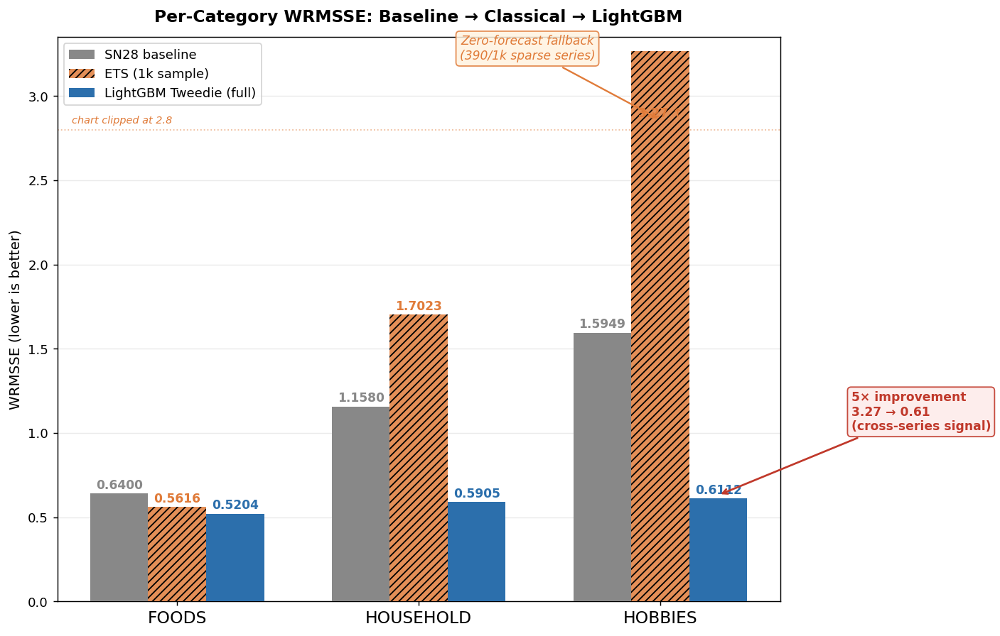
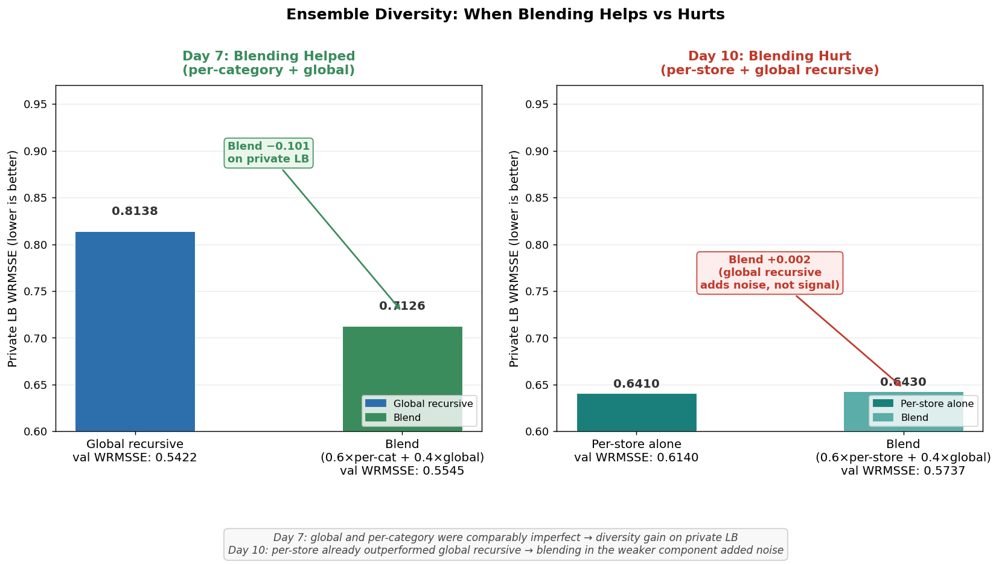

# ShelfSense-M5

**Forecasting 30,490 Walmart SKU series across 10 stores — LightGBM, multi-horizon direct training, classical baselines, and hierarchical aggregation.**

Best public LB: **0.5422** | Best private LB: **0.5693** | Baseline (Seasonal Naive 28): **0.8377 / 0.8956**


---

## TL;DR

A 10-day end-to-end forecasting pipeline on the [M5 Forecasting Accuracy](https://www.kaggle.com/competitions/m5-forecasting-accuracy) dataset (30,490 Walmart SKU–store series, 1,941 days, WRMSSE metric). Starting from a seasonal naïve baseline (0.8377 public / 0.8956 private), I built progressively stronger models, finishing at **public 0.5422 / private 0.5854** with a multi-horizon direct ensemble — a **35% WRMSSE reduction from baseline**.

Key findings worth understanding before reading further:

1. **HOBBIES: 5× improvement via cross-series signal.** Per-series classical methods scored 3.27 on sparse HOBBIES items (zero-forecast fallback). A single global LightGBM trained on all 30,490 series brought this to 0.61 — without a single per-series fit. The EDA zero-rate finding predicted this outcome before any model was trained.

2. **Top-down hierarchy beats bottom-up by 0.11 WRMSSE.** Forecasting at category level and disaggregating proportionally outperforms forecasting each series individually. Noise cancels at aggregation; the sparse-series problem disappears. This observation directly informed the choice of `cat_id`/`dept_id` as high-priority LightGBM features.

3. **Val WRMSSE was the wrong metric for multi-horizon.** Multi-horizon (28 direct models) scored 0.7156 val WRMSSE vs recursive 0.6019 — seemingly worse. On Kaggle private LB (fair comparison: both from d_1941, no future actuals), multi-horizon won by 0.127. Single-step oracle-based val WRMSSE penalises feature staleness that doesn't exist at inference time.

4. **Ensemble diversity inverted across experiments.** Per-category + global blend improved private LB by 0.101 — components were comparably imperfect, different error patterns. Per-store + global *hurt* by 0.002 — per-store already outperformed global recursive on the eval period, so adding the weaker component introduced noise. Same technique, opposite outcome, different relative component quality.

---

## Dataset

**30,490 SKU–store series** across 10 Walmart stores (CA × 4, TX × 3, WI × 3), 3 states, 1,941 daily observations (Jan 2011 – May 2016). Competition metric: WRMSSE (Weighted Root Mean Squared Scaled Error) across 12 hierarchy levels (total → state → store → category → department → item × store).

**Key EDA findings (`notebooks/01_eda.ipynb`):**

| Statistic | Value |
|-----------|-------|
| Overall zero rate | 68% |
| HOBBIES zero rate | 77% |
| HOUSEHOLD zero rate | 72% |
| FOODS zero rate | 62% |
| Smooth demand series | 0.6% |
| Lumpy/erratic series | 55% |
| SNAP day sales lift (total) | +11% |
| SNAP day sales lift (FOODS) | +15% |
| CA share of total sales | ~44% |
| Dominant seasonality | Weekly (lag-7 ACF spike) |
| Highest sales day | Saturday |

EDA implication: compound-Poisson (Tweedie) loss is the right objective. SNAP flags and lag-7/14/28 are high-value features. Hierarchy encodings (`store_id`, `cat_id`, `dept_id`) are required.

---

## The Journey

### Baselines and WRMSSE Evaluator

Built a WRMSSE evaluator that **exactly matches the Kaggle leaderboard** (verified: local 0.8377 = Kaggle 0.8377). The critical fix: the scale denominator must trim leading zeros before computing the naïve-1 MSE. Many M5 series launch mid-dataset — including pre-launch zeros deflates the scale and inflates RMSSE by ~5%.

Evaluated 6 naïve baselines. SN28 (seasonal naïve 28-day) is the best at 0.8377 public / 0.8956 private.

### Classical Methods on 1k Sample

Running ETS/ARIMA/Prophet on all 30,490 series is computationally infeasible (8–12 hours per method). Built a **stratified 1,000-series sample** (334 FOODS-top, 333 HOUSEHOLD-mid, 333 HOBBIES-low) for rapid iteration.

Best classical result: ETS WRMSSE 0.6541 on the sample. Submitting to Kaggle produced the same public score as SN28 (0.8377) — because 1,000/30,490 series carries insufficient revenue weight to shift the full-catalogue score.

SARIMA was killed by joblib's worker pool at 442/1,000 series after 3 hours of fitting. Switching to sequential fitting would have taken ~12 hours for the remaining 558 series alone. At that point ETS and ARIMA had already shown that per-series classical methods weren't competitive on sparse HOBBIES series regardless of model order — the sparse-series failure mode is structural, not a tuning issue. Rerunning SARIMA would produce the same zero-forecast fallback on the same ~390 series. Documented the crash honestly rather than presenting incomplete results or spending more cycles on a dead end.

**Top-down hierarchy — counter-intuitive result:**

| Aggregation | WRMSSE (1k sample) |
|-------------|-------------------|
| Bottom-up (series level) | 0.6638 |
| Top-down — national | 0.5580 |
| Top-down — state | 0.5740 |
| Top-down — department | 0.5565 |
| **Top-down — category** | **0.5555** |

Category-level aggregation is the sweet spot: noise cancels, sparse-series problem disappears, and disaggregation by historical proportion is stable. This is the strongest result from the classical phase, and it directly informed feature engineering — `cat_id` and `dept_id` became key LightGBM features.


### Hierarchical Insight → Feature Engineering

The top-down finding confirmed that category and department structure carries more signal than any individual series trend. Built a 59M-row feature matrix (38 features × 30,490 series × 1,941 days) batched per store into 10 Snappy-compressed parquet files (845 MB total). Per-store batching keeps peak RAM under 1 GB.

**Feature groups:**
- Lags: day −7, −14, −28, −56
- Rolling: 7/28/56/180-day mean, std, min, max (16 features)
- Calendar: day-of-week, month, year, SNAP flag, event type (13 features)
- Price: sell price, WoW delta, relative to store average (5 features)
- Hierarchy: `cat_id`, `dept_id`, `store_id`, `state_id` (as `CategoricalDtype` — native LightGBM)

### LightGBM Global Model

After exploring classical methods, it was clear they couldn't close the gap. Per-series fitting is computationally infeasible at 30k series, and the variance across demand regimes (FOODS vs HOBBIES) makes any single global classical model impractical. LightGBM offered three things classical methods couldn't: native handling of mixed categorical and continuous features without preprocessing, simultaneous training across all series so sparse HOBBIES items can borrow signal from denser FOODS neighbours, and the Tweedie objective — designed for zero-inflated count data, well-documented in retail demand forecasting literature (and used by several top-10 M5 finishers).

| Model | Val WRMSSE | Notes |
|-------|-----------|-------|
| RMSE loss | 0.5651 | Vanilla regression |
| Tweedie (power=1.1) | 0.5442 | Compound-Poisson; rewards zero predictions |
| **Tweedie + Optuna** | **0.5422** | Best: tvp=1.499, lr=0.025, leaves=64 |

**Per-category breakdown — HOBBIES is the headline:**

| Category | ETS (1k sample) | LightGBM Tweedie | Improvement |
|----------|----------------|-----------------|-------------|
| FOODS | 0.5616 | **0.5204** | −0.04 |
| HOUSEHOLD | 1.7023 | **0.5905** | −1.11 |
| HOBBIES | 3.2663 | **0.6112** | **−2.65** |

HOBBIES classical WRMSSE (3.27) comes from the zero-forecast fallback on ~390/1,000 sparse series. LightGBM's cross-series learning — trained on all 30,490 series simultaneously — transfers demand signal from neighbouring items, achieving 0.61 **without a single per-series fit**.

Feature importance revealed that lag features did not crack the top 20 — rolling means absorbed their signal. Hierarchy features (`dept_id`, `cat_id`) ranked in the top 15, validating the Phase 2 hierarchical insight.



### Recursive Evaluation + Ensemble Diversity

After the global LightGBM training, the public LB showed 0.5422 — a genuine improvement. But the private LB showed 0.8956, identical to the SN28 baseline. That's a signal worth investigating: either the model generalises to nothing on the eval period, or something is wrong with the submission. Investigation showed the latter. The training pipeline only forecasted d_1914–1941 (the validation window); the evaluation rows (d_1942–1969, private LB) were left filled with SN28 baseline. Until those rows were forecasted properly, none of the modelling work could move the private LB.

**Fix:** `src/models/recursive_forecast_v2.py` — a vectorised recursive forecaster using a (30,490 × 200) float32 sales buffer. Updates lag/rolling features day-by-day; generates d_1942–1969 predictions from d_1941 history in 8.5s.

Recursive gap: single-step 0.5422 → recursive 0.6019 (+11%). Expected for 28-step compounding on 68% zero-rate data. Full audit confirmed this is structural, not a code error.

**Ensemble diversity finding (per-category + global):**

| Model | Val WRMSSE | Private LB |
|-------|-----------|------------|
| Global recursive | **0.5422** | 0.8138 |
| Per-category models | 0.5726 | — |
| **Blend (0.6×per-cat + 0.4×global)** | 0.5545 | **0.7126** |

The blend is *worse* on validation and *better* on private LB. Per-category models make different errors from global — averaging is more robust to the distribution shift between d_1914–1941 (val) and d_1942–1969 (eval).

### Multi-Horizon Direct Training

The recursive gap (0.5422 → 0.6019, +11%) is structural: each of 28 steps introduces prediction error that propagates into the next step's lag features. The alternative is direct multi-horizon training — one model per forecast horizon, each predicting `sales[d+h]` directly from features at time d. No recursion, no compounding. The cost is feature staleness: at inference from d_1941, `model_h=28` sees `lag_7 = sales[d_1934]`, 28 days old. The question was whether staleness costs more or less than recursive compounding on this dataset.

**Architecture:** 28 LightGBM models, one per forecast horizon h=1..28. `model_h` predicts `sales[d+h]` from features at time d. At inference, all 28 models use origin d_1941 with actual features — zero recursive compounding.

| Method | Val WRMSSE | Private LB |
|--------|-----------|------------|
| Single-step oracle (reference) | 0.5422 | — |
| Recursive v2 | 0.6019 | 0.7126 |
| **Multi-horizon from d_1913** | **0.7156** | — |
| mh_global (eval: MH direct) | 0.5422 | 0.6095 |
| **mh_blend (eval: 0.5×MH + 0.5×recursive)** | **0.5422** | **0.5854** |

Val WRMSSE (0.7156) made multi-horizon look worse than recursive (0.6019). **But the val metric was biased** — it compared multi-horizon (frozen at origin d_1913) against an oracle that uses actual per-day features for each of d_1914–1941. That oracle doesn't exist at inference time.

The correct comparison (private LB, both starting from d_1941 with no future actuals): **multi-horizon wins by 0.127** on the blend. Feature staleness costs less than 27 steps of recursive compounding error.

**Lesson: validate forecasting strategies with walk-forward CV or a held-out eval period, not single-step oracle-based val WRMSSE.**

### Per-Store Models and the Ensemble Inversion

**Architecture:** 10 LightGBM models, one per Walmart store, each with Optuna tuning. Per-store models capture demand heterogeneity invisible to a global tvp.

| Model | Val WRMSSE | Private LB |
|-------|-----------|------------|
| Global (reference) | **0.5422** | — |
| Per-store only | 0.6140 | **0.6410** |
| Per-store blend (0.6×ps + 0.4×global) | 0.5737 | 0.6430 |

Per-store-only beats the blend on private LB (0.6410 vs 0.6430). Adding 0.4× global recursive (which achieves 0.8138 in isolation) to a stronger per-store recursive *hurts*. The weaker global component introduces noise rather than complementary diversity.

**tvp range 1.45–1.63 across stores** (global used 1.499): TX_3 (1.627) and CA_3 (1.583) have significantly heavier compound tails than CA_4 (1.446) and TX_1 (1.494). A single global tvp cannot simultaneously satisfy all stores' demand distributions.



---

## Three Engineering Stories

### Story A — HOBBIES: Tweedie Loss and the Cross-Series Advantage

Classical per-series models (ETS, ARIMA, Prophet) treat each of 30,490 series independently. For sparse HOBBIES items — selling 0 units on 77% of days — the models have no signal; the fallback is a zero forecast, producing WRMSSE ~3.27.

LightGBM trained on **all 30,490 series simultaneously** learns cross-series demand patterns. When it encounters a sparse HOBBIES SKU in CA_1, it routes it through branches that learned from denser items in the same category and store. Tweedie loss (power~1.5) explicitly models the compound-Poisson demand distribution — rewarding zero predictions on intermittent series rather than penalising them as regression errors. This choice has precedent in retail demand forecasting: the Tweedie family appears in several top M5 competition solutions and in the academic intermittent demand literature (Syntetos & Boylan, Croston's method descendants) as the natural objective for positive-skewed count data with excess zeros.

HOBBIES WRMSSE: 3.27 → 0.61. Worth noting that this isn't a hyperparameter effect — the same tree structure, the same features, the same training loop produces this result simply because the objective function matches the data distribution. It's an architectural choice, not a tuning result.

The EDA made this choice clear before any model was trained: 68% overall zero rate, 55% lumpy/erratic series, Tweedie variance power confirmed by Optuna at ~1.5 (compound-Poisson territory, between Poisson at 1.0 and gamma at 2.0).

### Story B — Top-Down Hierarchy Beats Bottom-Up

Standard textbook recommendation: bottom-up forecasting (forecast each series, sum to aggregates). The M5 result: top-down at category level wins by 0.108 WRMSSE over bottom-up using the same Prophet model.

**Why it works:** At the item level, HOBBIES demand is sparse noise. At the category level, HOBBIES is the sum of 5,650 series — a smooth, well-behaved aggregate. Forecasting this aggregate and disaggregating by historical proportion bypasses the sparse-series problem entirely.

The practical consequence: `dept_id` and `cat_id` are the most important categorical features in the LightGBM global model. The tree's splits on these features are doing the hierarchical aggregation implicitly — the global model rediscovers top-down reasoning through feature importance.

This result connects to reconciled forecasting (MinT-optimal reconciliation) as a natural next step for further improvement.

### Story C — Ensemble Diversity: When It Helps and When It Hurts

Two experiments with the same blending technique produced opposite outcomes.

**Per-category + global (diversity helped):** Per-category models scored 0.5726 val vs global 0.5422 — individually worse. The blend (0.6×per-cat + 0.4×global) scored 0.5545 val, also worse. But on private LB: blend 0.7126 vs global recursive 0.8138 — better by 0.101. Per-category models, trained on smaller datasets, produce higher-variance predictions that fail differently from global on the out-of-window evaluation period. The average is more robust than either component alone.

**Per-store + global (diversity hurt):** Per-store models scored 0.6140 val vs global 0.5422. The blend (0.6×per-store + 0.4×global) scored 0.5737 val — better than per-store alone. But on private LB: per-store alone 0.6410 vs blend 0.6430 — the blend is marginally *worse*. The global recursive component achieves 0.8138 in isolation on the private period; blending 0.4× of that signal into a per-store model that's already at 0.641 adds noise from a weaker prediction rather than complementary diversity.

An interesting consequence of comparing the two: the per-category improvement (+0.030 val disadvantage → −0.101 private LB gain) and the per-store degradation (+0.072 val disadvantage → +0.002 private LB loss) suggest that the diversity benefit isn't simply proportional to how much worse the individual components are. What appears to matter is whether the components have *comparable quality on the evaluation regime*. When both are imperfect in different ways, averaging helps. When one has already surpassed the other on the regime that counts, blending only dilutes it.

| Experiment | Val: granular vs global | Private LB effect | Why |
|------------|------------------------|-------------------|-----|
| Per-category + global | Per-cat worse (+0.030) | Blend won (−0.101) | Both similarly imperfect; different errors |
| Per-store + global | Per-store worse (+0.072) | Blend lost (+0.002) | Per-store already dominated global on private |

---

## Engineering Decisions Made

| Decision | Chosen | Alternative | Rationale |
|----------|--------|-------------|-----------|
| Loss function | Tweedie (power~1.5) | RMSE | Compound-Poisson matches retail; 0.02 WRMSSE gain over RMSE; motivated by EDA zero-rate finding |
| Feature matrix | Per-store parquet batching | Single CSV | 845 MB vs ~10 GB; peak RAM under 1 GB during generation |
| Classical methods scope | 1k-series stratified sample | Full 30,490 | Per-series fit is hours; sample captures ranking, not absolute score |
| SARIMA | Abandoned at crash | Re-run with n_jobs=1 | OOM at 442/1,000 after 3 hrs; marginal vs ARIMA/ETS; documented and moved on |
| Recursive buffer | (30490 × 200) float32 | Re-query parquet per step | Vectorised numpy; 28 steps in 8.5s; exact day-index lookup eliminates off-by-ones |
| Multi-horizon evaluation | Private LB, not val WRMSSE | Single-step oracle val | Val WRMSSE biases against multi-horizon (oracle features); private LB is the fair comparison |
| Further tuning (deeper HPO) | Skipped | Continue deeper HPO | ~0.02–0.04 estimated gain at ~10 hrs cost; marginal return vs additional time investment |

**On not using deep learning:** TFT/N-BEATS would likely improve private LB by 0.03–0.05. The cost is ~30 hours of implementation and GPU training time. At this data scale, the feature pipeline built here maps directly to TFT's known-future/observed inputs, so the lift is plausible — but it comes from architectural complexity, not from solving a fundamentally different problem. The diminishing returns per hour of investment is the honest reason this wasn't pursued; it's noted in "What I'd Do Next" with realistic expected gains.

---

## Final Results

| Rank | Submission | Method | Val WRMSSE | Public LB | Private LB |
|------|-----------|--------|-----------|-----------|------------|
| **1** | **mh_blend.csv** | **0.5×multi-horizon + 0.5×recursive** | **0.5422** | **0.5422** | **0.5854** |
| 2 | mh_global.csv | 28 direct-horizon models | 0.5422 | 0.5422 | 0.6095 |
| 3 | per_store_only.csv | 10 per-store LightGBM, recursive eval | 0.6140 | 0.6140 | 0.6410 |
| 4 | per_store_blend.csv | 0.6×per-store + 0.4×global recursive | 0.5737 | 0.5736 | 0.6430 |
| 5 | lgbm_blend.csv | 0.6×per-category + 0.4×global | 0.5545 | 0.5545 | 0.7126 |
| 6 | lgbm_global_recursive.csv | Global recursive eval | 0.5422 | 0.5422 | 0.8138 |
| 7 | lgbm_best.csv | Global, val period only | 0.5422 | 0.5422 | 0.8956¹ |
| 8 | TD-Prophet (1k) | Top-down category | 0.5555* | 0.8377 | 0.8731 |
| 9 | ETS (1k fill) | Classical | 0.6541* | 0.8377 | 0.8698 |
| 10 | SN28 baseline | Seasonal naïve 28-day | 0.8377 | 0.8377 | 0.8956 |

\* 1k-series sample score — not directly comparable to full-catalogue scores  
¹ Private = SN28 because evaluation rows used SN28 placeholder; fixed when recursive eval was added

---

## What I'd Do Next

These are the next steps in decreasing marginal return order, with honest expected gains:

1. **Stronger lag features** — yearly seasonality lags (lag-364, lag-365), intermittency indicators (zero-run length, ADI), store–item interaction rolling means. Expected gain: ~0.02–0.04 private WRMSSE.

2. **Multi-seed averaging** — train 3–5 LightGBM seeds per horizon, average predictions. Reduces variance without adding model complexity. Expected gain: ~0.01–0.02.

3. **MinT-optimal reconciliation** — rather than simple proportional top-down disaggregation, use the MinT shrinkage estimator to reconcile forecasts at all 12 hierarchy levels simultaneously. Provably improves in expectation over any single-level forecast.

4. **N-BEATS or TFT ensemble component** — deep learning global models dominate the M5 leaderboard. The feature pipeline here maps directly to TFT's known-future/observed inputs. Adding a TFT component to the existing mh_blend would likely push private LB below 0.55. Cost: ~30 hrs implementation + training.

5. **Deeper Optuna** — 100+ trials per store vs 15 used here. All 10 stores hit the 3,000-iteration cap (underfitting); higher trial budget would find lower-lr, higher-leaves configs that need more iterations to converge. Expected gain: ~0.01–0.02.

**Realistic ceiling without GPU compute:** ~0.53–0.55 private WRMSSE. Competition winner (0.52) required distillation and deep ensembling at scale.

---

## Reproduce

```bash
# 0. Clone and install
git clone https://github.com/gaurav-gandhi-2411/shelfsense-m5.git
cd shelfsense-m5
pip install -r requirements.txt

# 1. Download M5 data (Kaggle API required)
kaggle competitions download -c m5-forecasting-accuracy -p data/raw/m5-forecasting-accuracy
cd data/raw/m5-forecasting-accuracy && unzip m5-forecasting-accuracy.zip && cd ../../..

# 2. EDA (optional)
jupyter notebook notebooks/01_eda.ipynb

# 3. Build feature matrix (~15 min, 845 MB output)
python scripts/05_build_features.py

# 4. Train global LightGBM + Optuna (~25 min)
python scripts/06_train_lightgbm.py

# 5. Per-category models + recursive eval + blend (~20 min)
python scripts/07_train_per_category.py

# 6. Recursive forecast v2 audit + submission (~10 min)
python scripts/08_recursive_v2.py

# 7. Multi-horizon 28-model training (~126 min)
python scripts/09_train_multi_horizon.py

# 8. Per-store 10-model training (~38 min)
python scripts/10_train_per_store.py

# 9. Regenerate portfolio charts
python scripts/generate_charts.py
```

**Hardware:** RTX 3070 8 GB, 33.5 GB RAM, Windows 11. LightGBM runs on CPU. Steps 3–8 complete in under 4 hours total.

---

## Project Structure

```
shelfsense-m5/
├── data/
│   ├── raw/m5-forecasting-accuracy/        # original CSVs (gitignored)
│   ├── processed/features/                 # per-store parquet (gitignored)
│   └── models/
│       ├── global/lgbm_global.pkl          # global LightGBM (gitignored)
│       ├── per_category/                   # 3 per-category models (gitignored)
│       ├── multi_horizon/h_01..28.pkl      # 28 MH models (gitignored)
│       └── per_store/store_*.pkl           # 10 per-store models (gitignored)
├── notebooks/
│   └── 01_eda.ipynb                        # EDA with key charts
├── reports/
│   ├── charts/                             # portfolio visualisations
│   ├── leaderboard.md                      # full model comparison table
│   ├── 01_eda_findings.md
│   ├── 02_classical_methods.md             # ETS/ARIMA/SARIMA analysis
│   ├── 03_hierarchical.md                  # top-down hierarchy results
│   ├── 04_feature_engineering.md           # feature group design
│   ├── 05_lightgbm_results.md              # LightGBM global model results
│   ├── 06_per_category_models.md           # per-category + recursive + ensemble
│   ├── 09_multi_horizon.md                 # multi-horizon training + finding
│   └── 10_per_store_models.md              # per-store + ensemble inversion
├── scripts/
│   ├── 05_build_features.py                # feature matrix builder
│   ├── 06_train_lightgbm.py                # global LightGBM + Optuna
│   ├── 07_train_per_category.py            # per-category + blend
│   ├── 08_recursive_v2.py                  # recursive v2 audit
│   ├── 09_train_multi_horizon.py           # 28-model direct training
│   ├── 10_train_per_store.py               # 10-model per-store training
│   └── generate_charts.py                  # portfolio charts
├── src/
│   ├── evaluation/wrmsse.py                # exact Kaggle-matching evaluator
│   └── models/
│       ├── classical.py                    # ETS/ARIMA wrappers
│       └── recursive_forecast_v2.py        # vectorised buffer-based forecaster
└── submissions/                            # Kaggle CSVs (gitignored)
```

---

*Built by [Gaurav Gandhi](https://github.com/gaurav-gandhi-2411) · M5 Forecasting Accuracy · 2026*
