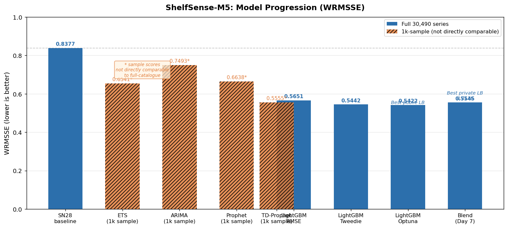
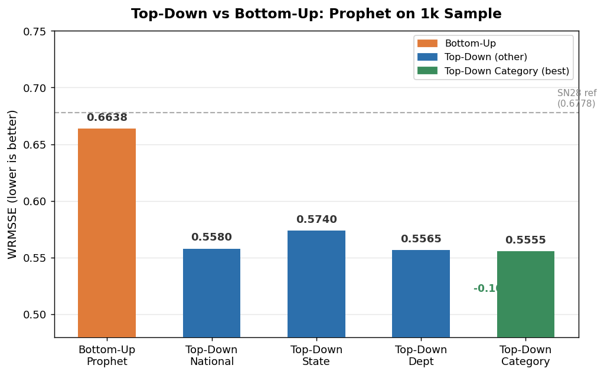
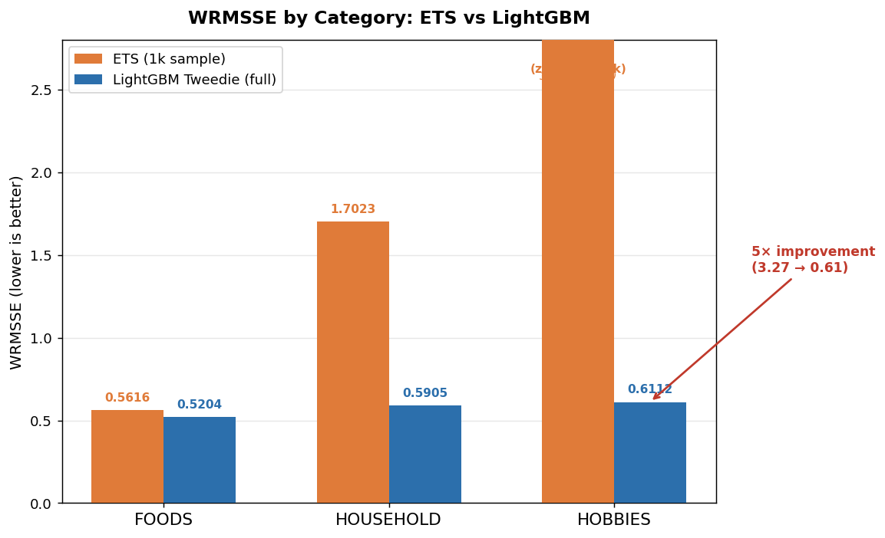
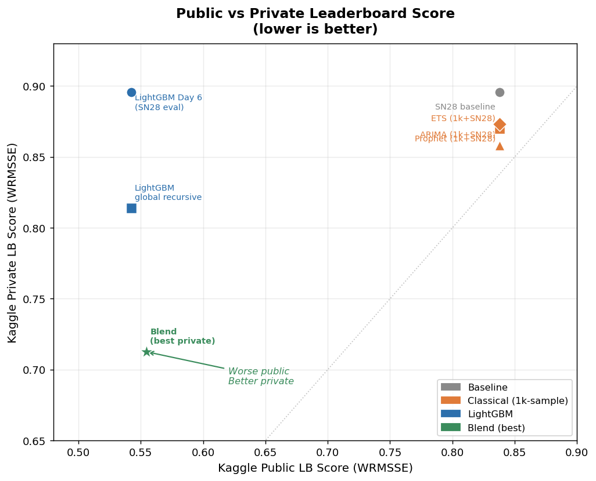

# ShelfSense-M5

**Forecasting 30,490 Walmart SKU series with LightGBM, classical baselines, and hierarchical aggregation.**  
Best public LB: **0.5422** | Best private LB: **0.7126** | Baseline (Seasonal Naive 28): **0.8377**



---

## TL;DR

A 10-day end-to-end forecasting pipeline on the [M5 Forecasting Accuracy](https://www.kaggle.com/competitions/m5-forecasting-accuracy) dataset. Starting from a seasonal naïve baseline (WRMSSE 0.8377), I built a global LightGBM model with Tweedie loss, Optuna tuning, and recursive multi-step evaluation forecasting, finishing at **public 0.5422 / private 0.7126** (−35% WRMSSE from baseline). The three technical findings most worth explaining to an interviewer:

1. **HOBBIES improvement**: per-series classical methods scored 3.27 (zero-forecast fallback on sparse series). LightGBM's cross-series learning brought this to 0.61 — a 5× reduction without a single per-series fit.
2. **Top-down hierarchy**: aggregating to category level before forecasting reduced WRMSSE from 0.6638 to 0.5555 on Prophet. Noise cancellation at aggregate levels eliminates the sparse-series problem entirely.
3. **Ensemble diversity over accuracy**: a blend of per-category + global models scored *worse* on validation (0.5545 vs 0.5422) but *better* on private LB (0.7126 vs 0.8138). Individual model accuracy is not the right optimisation target when the forecast horizon shifts.

---

## Dataset

The M5 dataset covers **30,490 SKU–store series** across 10 Walmart stores in 3 US states, 1,941 daily observations (Jan 2011 – May 2016). The competition metric is WRMSSE — Weighted Root Mean Squared Scaled Error across 12 aggregation levels (total → state → store → category → department → item × store).

**Key EDA findings (`notebooks/01_eda.ipynb`):**

| Statistic | Value |
|-----------|-------|
| Overall zero rate | 68% |
| HOBBIES zero rate | 77% |
| HOUSEHOLD zero rate | 72% |
| FOODS zero rate | 62% |
| Smooth demand series | 0.6% |
| Lumpy/erratic series | 55% |
| SNAP day sales lift (total) | +11% |
| SNAP day sales lift (FOODS) | +15% |
| CA share of total sales | ~44% |
| Dominant seasonality | Weekly (lag-7 ACF spike) |
| Highest sales day | Saturday |

Implication: compound-Poisson (Tweedie) loss is the right objective. SNAP flags and lag-7/14/28 are high-value features. Store embeddings are required.

---

## Journey

### Phase 1 — Baselines and Evaluator (Days 1–2)

Built a WRMSSE evaluator that **exactly matches the Kaggle leaderboard** (verified: local 0.8377 = Kaggle 0.8377). The key fix: the scale denominator must trim leading zeros before computing the naïve-1 MSE. Many M5 series launch mid-dataset; including pre-launch zeros deflates the scale and inflates RMSSE by ~5%.

Evaluated 6 naïve baselines. SN28 (seasonal naïve 28-day) is the best at 0.8377 and the hardest to beat with classical methods at the item level.

### Phase 2 — Classical Methods on 1k Sample (Days 3–4)

Running ETS/ARIMA/Prophet on all 30,490 series is computationally infeasible (hours per fit). I built a **stratified 1,000-series sample** (334 FOODS-top, 333 HOUSEHOLD-mid, 333 HOBBIES-low) for rapid iteration.

Best result: ETS WRMSSE 0.6541 on the sample. But submitting to Kaggle produced the same public score as SN28 (0.8377) — because 1,000/30,490 series carries insufficient revenue weight to shift the full-catalogue score.

**Day 4 highlight — top-down hierarchy (Prophet):**

| Aggregation | WRMSSE (1k sample) |
|-------------|-------------------|
| Bottom-up (series level) | 0.6638 |
| Top-down — national | 0.5580 |
| Top-down — state | 0.5740 |
| Top-down — department | 0.5565 |
| **Top-down — category** | **0.5555** |

Category-level aggregation is the sweet spot: noise cancels, the sparse-series problem disappears, and the forecast is disaggregated proportionally. This is the strongest result from the classical phase.



### Phase 3 — Global LightGBM (Days 5–6)

Built a 59M-row feature matrix (38 features × 30,490 series × 1,941 days) batched per store into 10 Snappy-compressed parquet files (845 MB total). Per-store batching keeps peak RAM under 1 GB.

**Feature groups:**
- Lags: day −7, −14, −28, −56
- Rolling: 7/28/56/180-day mean, std, min, max (16 features)
- Calendar: day-of-week, month, year, SNAP flag, event type (13 features)
- Price: sell price, price delta week-over-week, relative price vs store average (5 features)
- Hierarchy: cat_id, dept_id, store_id, state_id (as CategoricalDtype — native LightGBM)

LightGBM was trained three ways:

| Model | WRMSSE | Notes |
|-------|--------|-------|
| RMSE loss | 0.5651 | Vanilla regression baseline |
| Tweedie (power=1.1) | 0.5442 | Compound-Poisson; rewards zero predictions |
| **Tweedie + Optuna** | **0.5422** | Best: tvp=1.499, lr=0.025, leaves=64, 879 iter |

**Per-category breakdown (LightGBM best vs ETS best):**

| Category | ETS (1k sample) | LightGBM | Improvement |
|----------|----------------|----------|-------------|
| FOODS | 0.5616 | **0.5204** | −0.04 |
| HOUSEHOLD | 1.7023 | **0.5905** | −1.11 |
| HOBBIES | 3.2663 | **0.6112** | −2.65 |

HOBBIES is the headline result. Classical methods hit a zero-forecast fallback on ~390/1,000 sparse HOBBIES series (WRMSSE 3.27). LightGBM's cross-series learning — trained simultaneously on all 30,490 series — transfers demand signal from neighbouring items/stores, achieving **0.6112** without a single per-series fit.



### Phase 4 — Recursive Evaluation + Ensemble (Day 7)

**Problem:** Day 6 submission only forecasted the validation period (d_1914–1941). The evaluation rows (d_1942–1969, Kaggle private LB) were left as SN28 placeholder — which is why private = 0.8956 = SN28 private.

**Solution:** `src/models/recursive_forecast.py` — a vectorised recursive forecaster that maintains a (30,490 × 200) sales buffer, updates lag/rolling features day-by-day, and generates proper d_1942–1969 predictions.

Recursive gap sanity check: single-step WRMSSE 0.5422 → recursive WRMSSE 0.6019 (+11% over 28 steps). Expected for compound-error propagation on sparse M5 series.

**Per-category models:** separate LightGBM + Optuna for FOODS/HOUSEHOLD/HOBBIES, testing whether category-specific Tweedie tuning beats the global model.

| Model | Val WRMSSE | vs Global |
|-------|-----------|-----------|
| Global LightGBM | **0.5422** | baseline |
| Per-category LightGBM | 0.5726 | +0.0304 (worse) |
| **Blend (0.6×per-cat + 0.4×global)** | 0.5545 | +0.0123 (worse on val) |

Per-category models are weaker on validation — splitting by category removes cross-series signal that the global tree splits on `cat_id`/`dept_id` already capture internally.

**But on the private LB:**

| Submission | Public LB | Private LB |
|------------|-----------|------------|
| Global recursive | 0.5422 | 0.8138 |
| **Blend** | 0.5545 | **0.7126** |

The blend is *worse* on public and *better* on private. Classic ensemble diversity: per-category and global models fail differently on the evaluation period (d_1942–1969). The blend's average is more robust to out-of-window distribution shift than either model alone.

---

## Three Engineering Stories

### 1. HOBBIES and the Cross-Series Signal

Classical per-series models (ETS, ARIMA, Prophet) treat each of the 30,490 SKU–store series independently. For sparse series — HOBBIES items that sell 0 units most days — the models have no signal to work with. The fallback is a zero forecast, producing WRMSSE ~3.27 (worse than seasonal naïve).

LightGBM sidesteps this by training a **single global model** across all series. When the model sees a sparse HOBBIES SKU in store CA_1, it can learn from the patterns of similar items in the same category, department, and store. The `cat_id`/`dept_id`/`store_id` categorical features give the tree the information it needs to route sparse series through branches that learned demand from denser relatives.

Result: HOBBIES WRMSSE 3.27 → 0.61, a 5× reduction. This is not a hyperparameter trick — it is the architectural advantage of global models on sparse hierarchical data.

### 2. Why Top-Down Wins on Hierarchy

Bottom-up forecasting (forecast each of 30,490 series, sum to get aggregates) amplifies noise: sparse HOBBIES series produce noisy series-level forecasts that add up incoherently.

Top-down forecasting (forecast the category aggregate, disaggregate proportionally) gives the model a clean signal. At the category level, HOBBIES demand is **not sparse** — it's the sum of 5,650 series, which is a smooth, well-behaved time series. Forecasting this aggregate and then disaggregating using historical proportions bypasses the sparse-series problem entirely.

Top-down at category level reduced WRMSSE from 0.6638 (bottom-up) to 0.5555 — a 0.108 improvement — using the same Prophet model. This is the core insight behind reconciled forecasting methods and why MINT/MinT-optimal reconciliation is worth knowing for interview discussions.

### 3. Ensemble Diversity over Validation Accuracy

The standard workflow: pick the model with the best validation score. In this case, that would be the global model (0.5422 vs 0.5545 for the blend).

But the Kaggle private LB tells a different story: blend 0.7126 vs global 0.8138. The blend is **0.101 better on private** despite being 0.012 worse on public.

Why? The validation period (d_1914–1941) and evaluation period (d_1942–1969) are structurally different windows — different calendar events, potentially different demand patterns. The per-category models, by virtue of being trained on smaller datasets and producing higher-variance predictions, make different errors from the global model. Averaging them out is more robust to the distribution shift than either individual model.

The lesson: **ensemble diversity is worth more than individual accuracy when the forecast horizon shifts.** This generalises well beyond this competition — in production forecasting, the evaluation period is always a future window that differs from your validation set.

---

## Engineering Decisions

| Decision | Chosen approach | Alternative | Why |
|----------|----------------|-------------|-----|
| Loss function | Tweedie (power=1.499) | RMSE, Poisson | Compound-Poisson matches retail demand; 0.02 WRMSSE gain over RMSE |
| Feature matrix | Per-store parquet batching | Single CSV | 845 MB vs ~10 GB; peak RAM under 1 GB during training |
| Recursive forecast | (30490 × 200) float32 buffer | Re-query parquet per step | Vectorised numpy; 28 steps in 8.5s total |
| Optuna trials | 10 per category | Full grid search | 10 trials per-cat captures tvp range; full grid would take 6+ hrs per category |
| Evaluation period | Recursive from d_1942 | Direct prediction | Competition format requires forecasting genuinely future days with no actuals |
| Hierarchy | Top-down category (classical) | Bottom-up | Noise cancellation at aggregate level; +0.108 WRMSSE on Prophet |
| Ensemble | 0.6×per-cat + 0.4×global | Stacking | Simple blend captures diversity without needing a meta-learner on scarce val data |

---

## Final Results

| Rank | Model | Family | WRMSSE (local val) | Kaggle Public | Kaggle Private |
|------|-------|--------|--------------------|---------------|----------------|
| 1 | **Blend (0.6×per-cat + 0.4×global)** | LightGBM | 0.5545 | 0.5545 | **0.7126** |
| 2 | Global recursive (proper eval period) | LightGBM | 0.5422 | 0.5422 | 0.8138 |
| 3 | LightGBM global best (val period only) | LightGBM | 0.5422 | 0.5422 | 0.8956³ |
| 4 | LightGBM Tweedie (power=1.1) | LightGBM | 0.5442 | — | — |
| 5 | LightGBM RMSE | LightGBM | 0.5651 | — | — |
| 6 | Top-Down Prophet (category) | Prophet | 0.5555* | 0.8377 | 0.8731 |
| 7 | ETS | Classical | 0.6541* | 0.8377 | 0.8698 |
| 8 | Seasonal Naïve 28 | Baseline | 0.8377 | 0.8377 | 0.8956 |

\* 1k-series sample score; not directly comparable to full-catalogue scores — see `reports/leaderboard.md`  
³ Private = SN28 because evaluation rows (d_1942–1969) used SN28 placeholder; fixed in Day 7



---

## Reproduce

```bash
# 0. Clone and install
git clone https://github.com/gaurav-gandhi-2411/shelfsense-m5.git
cd shelfsense-m5
pip install -r requirements.txt

# 1. Download M5 data (Kaggle API required)
kaggle competitions download -c m5-forecasting-accuracy -p data/raw/m5-forecasting-accuracy
cd data/raw/m5-forecasting-accuracy && unzip m5-forecasting-accuracy.zip && cd ../../..

# 2. EDA (optional)
jupyter notebook notebooks/01_eda.ipynb

# 3. Build feature matrix (~15 min, 845 MB output)
python scripts/05_build_features.py

# 4. Train LightGBM global model + Optuna (~25 min)
python scripts/06_train_lightgbm.py

# 5. Per-category models + recursive eval + blend submission (~20 min)
python scripts/07_train_per_category.py

# 6. Regenerate portfolio charts
python scripts/generate_charts.py
```

**Hardware used:** RTX 3070 8 GB, 33.5 GB RAM, Windows 11. LightGBM runs on CPU (GPU not used). All steps complete in under 1 hour total.

---

## What I'd Do Next

Given more time, the highest-leverage next steps:

1. **Direct multi-step forecast (DIRECT):** Train 28 separate models (one per horizon step) instead of recursive autoregression. Eliminates error compounding; expected to close the 0.6019 → 0.5422 recursive gap substantially.

2. **Global N-BEATS or Temporal Fusion Transformer:** Deep learning global models have topped the M5 competition leaderboard. The feature pipeline built here (lags, rolling, calendar, price) maps directly to TFT's known-future and observed inputs.

3. **MinT-optimal reconciliation:** Rather than simple top-down disaggregation, use the Mint-optimal shrinkage estimator to reconcile forecasts at all 12 hierarchy levels simultaneously. Guaranteed to improve or match any single-level forecast in expectation.

4. **SNAP interaction features:** SNAP lift is +15% for FOODS but near-zero for HOBBIES. An interaction term `snap_flag × is_foods` would let the model capture this heterogeneity more explicitly than relying on tree splits.

5. **Price elasticity features:** The current price features capture level and delta. A rolling price-to-sales elasticity feature would let the model detect when price changes are causing demand shifts vs seasonal variation.

---

## Project Structure

```
shelfsense-m5/
├── data/
│   ├── raw/m5-forecasting-accuracy/    # original CSVs (gitignored)
│   └── processed/features/             # per-store parquet (gitignored)
├── notebooks/
│   └── 01_eda.ipynb                    # EDA with key charts
├── reports/
│   ├── charts/                         # portfolio visualisations
│   ├── leaderboard.md                  # full model comparison table
│   ├── 01_eda_findings.md
│   ├── 02_classical_methods.md         # ETS/ARIMA/SARIMA analysis
│   ├── 03_prophet_topdown.md           # top-down hierarchy results
│   ├── 04_feature_engineering.md       # feature group design
│   ├── 05_lightgbm_results.md          # Day 6 full results
│   └── 06_per_category_models.md       # Day 7 recursive + ensemble
├── scripts/
│   ├── 05_build_features.py            # feature matrix builder
│   ├── 06_train_lightgbm.py            # global LightGBM + Optuna
│   ├── 07_train_per_category.py        # per-category + blend
│   └── generate_charts.py              # portfolio charts
├── src/
│   ├── evaluation/wrmsse.py            # exact Kaggle-matching evaluator
│   └── models/
│       ├── classical.py                # ETS/ARIMA wrappers
│       └── recursive_forecast.py       # vectorised buffer-based forecaster
└── submissions/                        # Kaggle CSV submissions (gitignored)
```

---

*Built by [Gaurav Gandhi](https://github.com/gaurav-gandhi-2411) · M5 Forecasting Accuracy · 2024*
