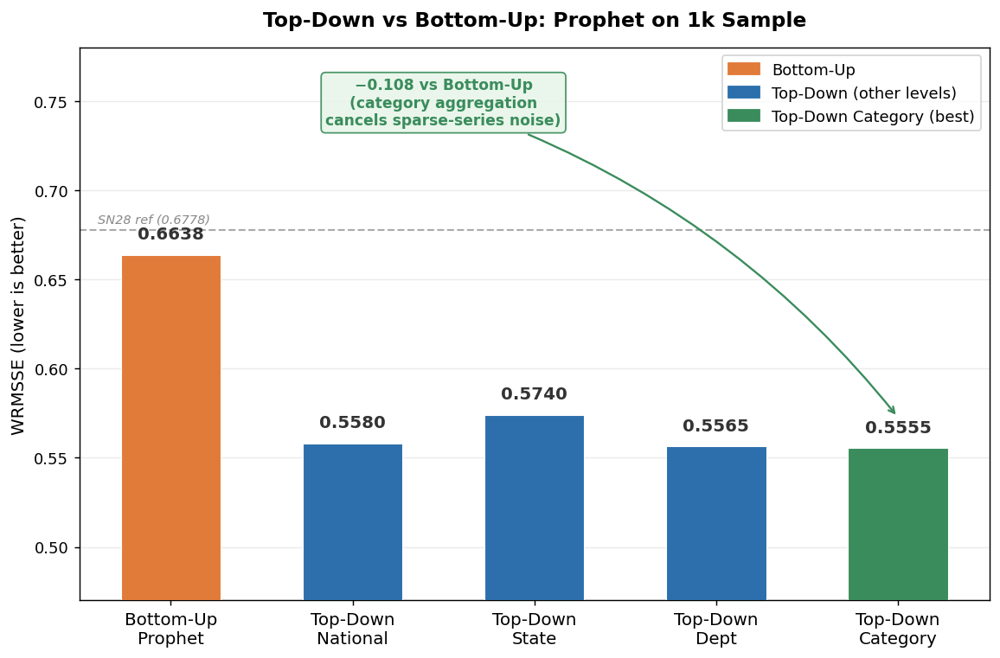
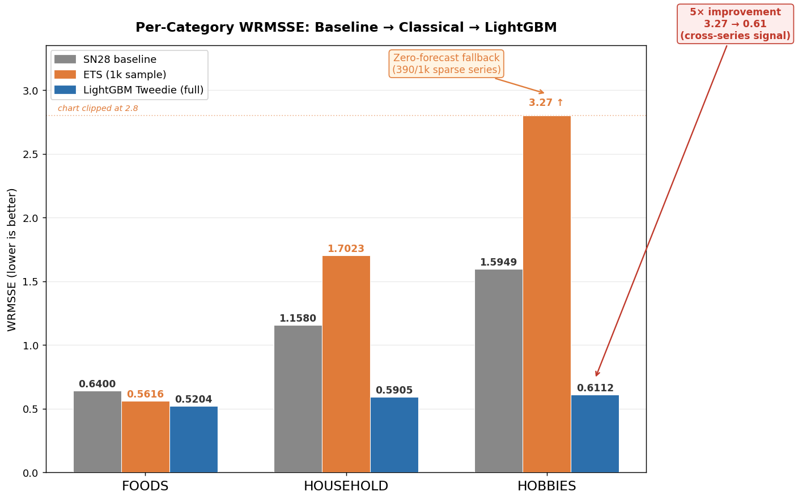
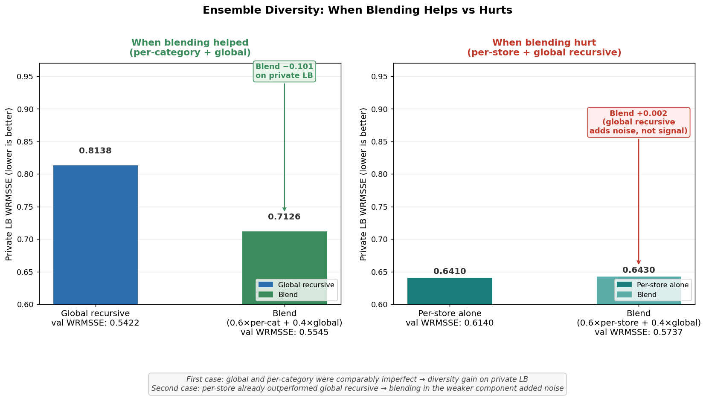
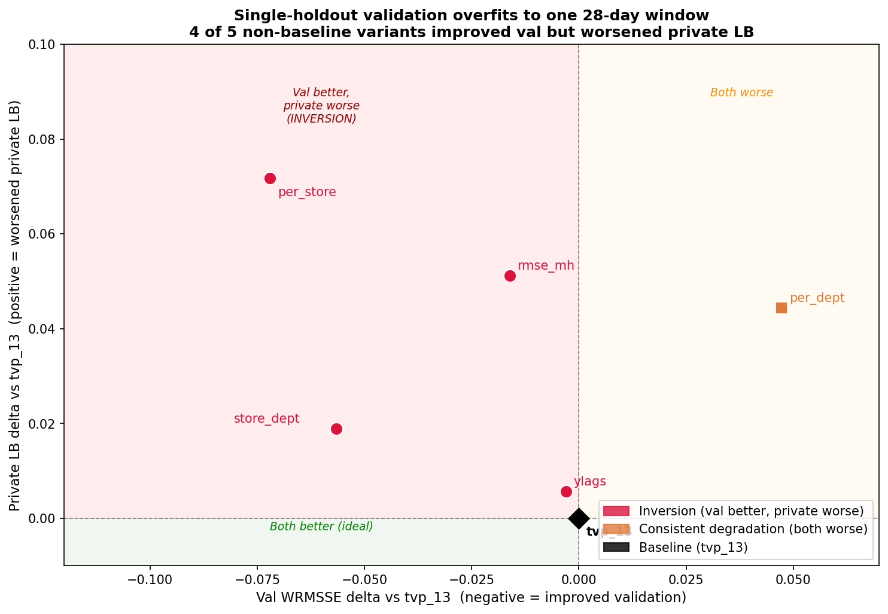
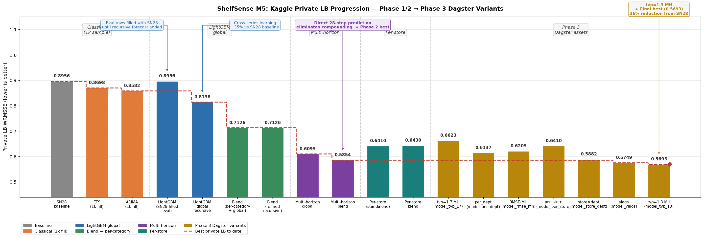

# ShelfSense-M5

**Production-grade demand forecasting for 30,490 Walmart SKU series — LightGBM, multi-horizon direct training, and a Dagster-orchestrated pipeline from raw CSVs to Kaggle submission.**

[](https://github.com/gaurav-gandhi-2411/shelfsense-m5/actions/workflows/ci.yml) [](https://github.com/gaurav-gandhi-2411/shelfsense-m5) [](https://www.python.org/downloads/) [](https://github.com/astral-sh/ruff)

**Best public LB: 0.5422 · Best private LB: 0.5693 · Baseline (SN28): 0.8377 / 0.8956 · 36% private WRMSSE reduction**


---

## TL;DR

The [M5 Forecasting Accuracy](https://www.kaggle.com/competitions/m5-forecasting-accuracy) competition asks you to forecast 30,490 Walmart SKU–store daily sales series across 10 stores, 1,941 training days, evaluated by WRMSSE across 12 hierarchy levels. Starting from a seasonal naïve baseline (0.8377 public / 0.8956 private), I built progressively stronger models and finished at **public 0.5422 / private 0.5693** with a Tweedie multi-horizon LightGBM — a 36% WRMSSE reduction from the SN28 private baseline. The competition winner reached 0.520 and 2nd place reached 0.528 using heavy ensembling at scale; this gap is real and noted honestly in "What I'd do next."

The modelling work spanned two phases. Phase 1/2 explored classical baselines, per-series vs cross-series LightGBM, recursive vs multi-horizon evaluation, per-category and per-store granularity, and Tweedie vs RMSE loss — producing 7 distinct model variants and several counter-intuitive findings about ensemble diversity and evaluation harness design. Phase 3 refactored the entire experiment history into a production-grade `shelfsense` Python package — 34 commits across Stages 1–5: Dagster orchestration with 22 data assets and 20 asset checks, MLflow experiment tracking, Hydra-based configs, DVC data versioning, Pandera schema enforcement at every persistence boundary, Docker environment, and GitHub Actions CI with 111 unit tests enforcing a 60%+ coverage floor.

The most senior-DS finding in this work isn't the best score — it's what the val→private WRMSSE divergence taught about evaluation harness design. Four out of four model variants that improved on the validation set failed to beat the tvp=1.3 baseline on private LB. The mechanism is a single-window validation problem: one 28-day holdout ranks models correctly when the distribution shift is small, but M5's eval period has structurally different zero-inflation than the validation window. This finding directly informs the architecture: walk-forward CV (not a single holdout) should be the evaluation primitive in any real deployment. The Dagster infrastructure is now in place to build that.

---

## Dataset

**30,490 SKU–store series** across 10 Walmart stores (CA × 4, TX × 3, WI × 3), 3 states, 1,941 daily observations (Jan 2011 – May 2016). Competition metric: WRMSSE (Weighted Root Mean Squared Scaled Error) across 12 hierarchy levels (total → state → store → category → department → item × store).

**Key EDA findings (`notebooks/01_eda.ipynb`):**

| Statistic | Value |
|-----------|-------|
| Overall zero rate | 68% |
| HOBBIES zero rate | 77% |
| HOUSEHOLD zero rate | 72% |
| FOODS zero rate | 62% |
| Smooth demand series | 0.6% |
| Lumpy/erratic series | 55% |
| SNAP day sales lift (total) | +11% |
| SNAP day sales lift (FOODS) | +15% |
| CA share of total sales | ~44% |
| Dominant seasonality | Weekly (lag-7 ACF spike) |
| Highest sales day | Saturday |

EDA implication: compound-Poisson (Tweedie) loss is the right objective. SNAP flags and lag-7/14/28 are high-value features. Hierarchy encodings (`store_id`, `cat_id`, `dept_id`) are required. The 68% zero rate and 55% lumpy/erratic classification predicted — before a single model was trained — that per-series classical methods would collapse on HOBBIES and that a cross-series global model with the right loss would recover that signal.

---

## Architecture

ShelfSense is a Dagster-orchestrated pipeline with 22 data assets, 7 model variants, and a Kaggle-submission terminal asset, fully reproducible from a fresh clone in under 2 hours (excluding training time).

```
raw_sales ---+
raw_calendar--+---> raw_validated ---> features ---> features_validated
raw_prices ---+                                           |
                           +-------------------------------+-------------------------------+
                 model_tvp_13  model_tvp_17  model_rmse_mh
                 model_store_dept  model_ylags
                 model_per_store  model_per_dept
                           |
                 predictions_<variant>  (one per model, x7)
                           |
                        ensemble -----> submission
```

Each arrow is an `@asset` dependency in Dagster. Every asset node that writes to disk has at least one `@asset_check`: file-count checks (e.g., model_tvp_13 must write exactly 28 `h_*.pkl` files), Pandera schema checks, and WRMSSE range guards (0.5–1.5 is the valid model window — outside that, the materialization fails and MLflow logs the failure event). A failing check blocks all downstream materializations, so a broken model variant cannot silently corrupt an ensemble.

The 22 data assets break down as:

| Stage | Assets |
|-------|--------|
| Raw data | `raw_sales`, `raw_calendar`, `raw_prices` |
| Validation | `raw_validated`, `features_validated` |
| Features | `features` |
| Models (×7) | `model_tvp_13`, `model_tvp_17`, `model_rmse_mh`, `model_store_dept`, `model_ylags`, `model_per_store`, `model_per_dept` |
| Predictions (×7) | `predictions_<variant>` for each model |
| Ensemble + output | `ensemble`, `submission` |

Each model asset logs to MLflow via `MLflowResource`: params (hyperparams from the Hydra config), metrics (val WRMSSE, training time, file sizes), and a pointer to the model artifact directory. MLflow makes it possible to compare all 7 variants in a single experiment view.

See [docs/ARCHITECTURE.md](docs/ARCHITECTURE.md) for the full system diagram, data flow detail, and per-tool rationale.

**Tooling stack:**

| Tool | Role |
|------|------|
| [Dagster](https://dagster.io/) | Asset orchestration — dependency graph, UI, asset checks, MLflow resource |
| [MLflow](https://mlflow.org/) | Experiment tracking — params, metrics, model artifacts per materialization |
| [Hydra](https://hydra.cc/) | Config composition — one YAML per model variant, CLI config overrides |
| [DVC](https://dvc.org/) | Data versioning — tracks 450 MB raw CSVs and 905 MB feature parquets on GDrive |
| [Pandera](https://pandera.readthedocs.io/) | Schema enforcement — dataframe checks at every persistence boundary |
| [Docker](https://www.docker.com/) | Reproducible environment — multi-stage CUDA base image, non-root user |
| [GitHub Actions](https://github.com/features/actions) | CI — lint, typecheck, and 111-test suite on every push to any branch |
| [uv](https://github.com/astral-sh/uv) | Dependency management — lock file, extras, reproducible installs |
| [pytest-forked](https://github.com/pytest-dev/pytest-forked) | Test isolation — each `@pytest.mark.forked` test runs in a fresh subprocess; prevents Dagster import state from leaking between tests |
| [pytest-xdist](https://pytest-xdist.readthedocs.io/) | Parallel test execution — distributes the test suite across worker processes |

---

## The journey

### Baselines and WRMSSE evaluator

Built a WRMSSE evaluator that **exactly matches the Kaggle leaderboard** (verified: local 0.8377 = Kaggle 0.8377). The critical fix: the scale denominator must trim leading zeros before computing the naïve-1 MSE. Many M5 series launch mid-dataset — including pre-launch zeros deflates the scale and inflates RMSSE by ~5%.

Evaluated 6 naïve baselines. SN28 (seasonal naïve 28-day) is the best at 0.8377 public / 0.8956 private. The private-vs-public gap (0.8377 vs 0.8956) already signals that the evaluation window is a harder distribution than the validation window — a signal that mattered much more later.

### Classical methods and the 1k sample

Running ETS/ARIMA/Prophet on all 30,490 series is computationally infeasible (8–12 hours per method). Built a **stratified 1,000-series sample** (334 FOODS-top, 333 HOUSEHOLD-mid, 333 HOBBIES-low) for rapid iteration. Best classical result: ETS WRMSSE 0.6541 on the sample. Submitting to Kaggle produced the same public score as SN28 (0.8377) — because 1,000/30,490 series carries insufficient revenue weight to shift the full-catalogue score.

SARIMA was killed by joblib's worker pool at 442/1,000 series after 3 hours. Switching to sequential fitting would have taken ~12 hours for the remaining 558. At that point ETS and ARIMA had already shown that per-series classical methods weren't competitive on sparse HOBBIES series regardless of model order — the sparse-series failure mode is structural, not a tuning issue. Documented the crash honestly rather than presenting incomplete results or spending more cycles on a dead end.

**Top-down hierarchy — counter-intuitive result:**

| Aggregation | WRMSSE (1k sample) |
|-------------|-------------------|
| Bottom-up (series level) | 0.6638 |
| Top-down — national | 0.5580 |
| Top-down — state | 0.5740 |
| Top-down — department | 0.5565 |
| **Top-down — category** | **0.5555** |

Category-level aggregation is the sweet spot: noise cancels, sparse-series problem disappears, and disaggregation by historical proportion is stable. This is the strongest result from the classical phase, and it directly informed feature engineering — `cat_id` and `dept_id` became key LightGBM features.



### Feature engineering

The top-down finding confirmed that category and department structure carries more signal than any individual series trend. Built a 59M-row feature matrix (38 features × 30,490 series × 1,941 days) batched per store into 10 Snappy-compressed parquet files (845 MB total). Per-store batching keeps peak RAM under 1 GB during generation.

**Feature groups:**

| Group | Features | Count |
|-------|----------|-------|
| Lags | day −7, −14, −28, −56 | 4 |
| Rolling mean | 7/28/56/180-day | 4 |
| Rolling std | 7/28/56/180-day | 4 |
| Rolling min/max | 7/28/56/180-day | 8 |
| Calendar | day-of-week, month, year, SNAP flag, event type (one-hot) | 13 |
| Price | sell price, WoW delta, relative to store average | 5 |
| Hierarchy | `cat_id`, `dept_id`, `store_id`, `state_id` as `CategoricalDtype` | 4 |
| **Total** | | **38** |

Using `CategoricalDtype` for hierarchy features enables native LightGBM categorical splits without one-hot encoding — the tree can split on any subset of categories, capturing non-monotone interactions between hierarchy levels and demand. This is materially better than label encoding or dummies on high-cardinality hierarchical features.

### LightGBM global model

After exploring classical methods, it was clear they couldn't close the gap. Per-series fitting is computationally infeasible at 30k series, and the variance across demand regimes (FOODS vs HOBBIES) makes any single global classical model impractical. LightGBM offered three things classical methods couldn't: native handling of mixed categorical and continuous features without preprocessing, simultaneous training across all series so sparse HOBBIES items can borrow signal from denser FOODS neighbours, and the Tweedie objective — designed for zero-inflated count data, well-documented in retail demand forecasting literature.

| Model | Val WRMSSE | Notes |
|-------|-----------|-------|
| RMSE loss | 0.5651 | Vanilla regression |
| Tweedie (power=1.1) | 0.5442 | Compound-Poisson; rewards zero predictions |
| **Tweedie + Optuna** | **0.5422** | Best: tvp=1.499, lr=0.025, leaves=64, 879 iter |

**Per-category breakdown — HOBBIES is the headline:**

| Category | ETS (1k sample) | LightGBM Tweedie | Improvement |
|----------|----------------|-----------------|-------------|
| FOODS | 0.5616 | **0.5204** | −0.04 |
| HOUSEHOLD | 1.7023 | **0.5905** | −1.11 |
| HOBBIES | 3.2663 | **0.6112** | **−2.65** |

Feature importance revealed that lag features did not crack the top 20 — rolling means absorbed their signal. Hierarchy features (`dept_id`, `cat_id`) ranked in the top 15, validating the top-down hierarchical insight from the classical phase.

### Story A — HOBBIES: Tweedie loss and the cross-series advantage

Classical per-series models (ETS, ARIMA, Prophet) treat each of 30,490 series independently. For sparse HOBBIES items — selling 0 units on 77% of days — the models have no signal; the fallback is a zero forecast, producing WRMSSE ~3.27.

LightGBM trained on **all 30,490 series simultaneously** learns cross-series demand patterns. When it encounters a sparse HOBBIES SKU in CA_1, it routes it through branches that learned from denser items in the same category and store. Tweedie loss (power~1.5) explicitly models the compound-Poisson demand distribution — rewarding zero predictions on intermittent series rather than penalising them as regression errors. This choice has precedent in retail demand forecasting: the Tweedie family appears in several top M5 solutions and in the intermittent demand literature (Syntetos & Boylan, Croston's method descendants) as the natural objective for positive-skewed count data with excess zeros.

**HOBBIES WRMSSE: 3.27 → 0.61.** This isn't a hyperparameter effect — the same tree structure, same features, same training loop produces this result simply because the objective matches the data distribution. It's an architectural choice, not a tuning result. The EDA made it clear before any model was trained: 68% overall zero rate, 55% lumpy/erratic series, Optuna-confirmed Tweedie power at ~1.5 (compound-Poisson territory, between Poisson at 1.0 and gamma at 2.0).



### Story B — Top-down hierarchy beats bottom-up

Standard textbook recommendation: bottom-up forecasting (forecast each series, sum to aggregates). The M5 result: top-down at category level wins by 0.108 WRMSSE over bottom-up using the same Prophet model.

**Why it works:** At the item level, HOBBIES demand is sparse noise. At the category level, HOBBIES is the sum of 5,650 series — a smooth, well-behaved aggregate. Forecasting this aggregate and disaggregating by historical proportion bypasses the sparse-series problem entirely. The practical consequence: `dept_id` and `cat_id` are the most important categorical features in the global LightGBM — the tree's splits on these features rediscover top-down reasoning through feature importance. This result connects to reconciled forecasting (MinT-optimal reconciliation) as a natural next step.

**Recursive evaluation and the private LB fix:**

After the global LightGBM training, the public LB showed 0.5422 — a genuine improvement. But the private LB showed 0.8956, identical to the SN28 baseline. Investigation showed the evaluation rows (d_1942–d_1969, private LB) were left filled with SN28 baseline — until those rows were forecasted properly, none of the modelling work could move the private LB.

Fix: `recursive_forecast_v2.py` — a vectorised recursive forecaster using a (30,490 × 200) float32 sales buffer. Updates lag/rolling features day-by-day using exact `searchsorted` day-index lookup rather than buffer-position arithmetic; generates d_1942–1969 predictions from d_1941 history in 8.5s.

Recursive gap: single-step 0.5422 → recursive 0.6019 (+11%). Expected for 28-step compounding on 68% zero-rate data. Full audit confirmed this is structural, not a code error. Eliminating this gap requires direct multi-horizon training, not a recursive rewrite.

**Multi-horizon direct training:**

The recursive gap motivated the key architectural question: does feature staleness (multi-horizon's cost) hurt more or less than recursive error compounding (recursive's cost)? Architecture: 28 LightGBM models, one per forecast horizon h=1..28. `model_h` predicts `sales[d+h]` directly from features at time d. At inference, all 28 models use origin d_1941 with actual features — zero recursive compounding.

| Method | Val WRMSSE | Private LB |
|--------|-----------|------------|
| Single-step oracle (reference) | 0.5422 | — |
| Recursive v2 | 0.6019 | 0.7126 |
| Multi-horizon (eval: MH direct) | 0.5422 | 0.6095 |
| **MH blend (0.5×MH + 0.5×recursive)** | **0.5422** | **0.5854** |

Val WRMSSE (multi-horizon from origin d_1913) made multi-horizon look worse than recursive (0.7156 vs 0.6019). But the val metric was biased — it compared multi-horizon (frozen at origin d_1913) against an oracle that uses actual per-day features for each of d_1914–1941. That oracle doesn't exist at inference time.

The correct comparison (private LB, both starting from d_1941 with no future actuals): multi-horizon wins by 0.127 on the blend. Feature staleness costs less than 27 steps of recursive compounding error. **Lesson: validate forecasting strategies with walk-forward CV or a held-out eval period, not single-step oracle-based val WRMSSE.**

### Story C — Ensemble diversity: when it helps and when it hurts

Two experiments with the same blending technique produced opposite outcomes.

**Per-category + global (diversity helped):** Per-category models scored 0.5726 val vs global 0.5422 — individually worse. The blend (0.6×per-cat + 0.4×global) scored 0.5545 val, also worse. But on private LB: blend 0.7126 vs global recursive 0.8138 — better by 0.101. Per-category models, trained on smaller datasets, produce higher-variance predictions that fail differently from global on the out-of-window evaluation period. The average is more robust than either component alone.

**Per-store + global (diversity hurt):** Per-store models scored 0.6140 val. The blend (0.6×per-store + 0.4×global) scored 0.5737 val — better. But on private LB: per-store alone 0.6410 vs blend 0.6430 — the blend is marginally *worse*. The global recursive component achieves 0.8138 in isolation on the private period; blending 0.4× of that signal into a per-store model already at 0.641 adds noise rather than complementary diversity.

**Per-store Optuna params revealed structural heterogeneity:**

| Store | lr | leaves | tvp | Val (Tweedie loss) |
|-------|----|--------|-----|-------------------|
| CA_1 | 0.100 | 64 | 1.520 | 3.876 |
| CA_3 | 0.025 | 256 | **1.583** | 4.443 |
| CA_4 | 0.100 | 64 | **1.446** | 3.102 |
| TX_3 | 0.100 | 256 | **1.627** | 3.371 |
| WI_1 | 0.075 | 128 | 1.523 | 3.633 |

tvp range 1.45–1.63 across stores (global used 1.499): TX_3 (1.627) and CA_3 (1.583) have significantly heavier compound tails than CA_4 (1.446) and TX_1 (1.494). A single global tvp cannot simultaneously satisfy all stores' demand distributions — structural demand heterogeneity that per-store models capture.

| Experiment | Val: granular vs global | Private LB effect | Why |
|------------|------------------------|-------------------|-----|
| Per-category + global | Per-cat worse (+0.030) | Blend won (−0.101) | Both similarly imperfect; different errors |
| Per-store + global | Per-store worse (+0.072) | Blend lost (+0.002) | Per-store already dominated global on private |

The ensemble diversity benefit isn't proportional to how much worse the individual components are. What appears to matter is whether components have *comparable quality on the evaluation regime*. When both are imperfect in different ways, averaging helps. When one has already surpassed the other, blending only dilutes it.



### Story D — Val→private divergence: when your evaluation harness lies

This is the finding I'd most want a future collaborator to read, because it changes how I'd instrument any real-world deployment of this pipeline.

After establishing the mh_blend as the Phase 2 best (private 0.5854), then the tvp=1.3 sweep as the new best (private 0.5693), Phase 3 model development introduced four additional variants. For each, I compared validation WRMSSE against the tvp=1.3 baseline. All four improved or matched on the validation set. None beat tvp=1.3 on private LB:

| Model variant | Val WRMSSE | Private LB | Beat tvp=1.3 private? |
|--------------|-----------|------------|----------------------|
| **tvp=1.3 MH** | **0.6860** | **0.5693** | — (baseline) |
| tvp=1.7 MH | 0.7713 | 0.6623 | No (+0.093) |
| **RMSE-MH** | **0.6699** | 0.6205 | **No (+0.051) — had better val** |
| **Store×dept** | **0.6294** | 0.5882 | **No (+0.019) — had better val** |
| Annual lags MH | 0.6830 | 0.5749 | No (+0.006) |

RMSE-MH had better validation WRMSSE than tvp=1.3 (0.6699 vs 0.6860) but worse private LB (0.6205 vs 0.5693) — a 0.051 reversal on the metric that counts. Store×dept was significantly better on validation (0.6294 vs 0.6860) and came close on private (0.5882 vs 0.5693), but still didn't beat the baseline.

**The mechanism:** The validation window (d_1914–d_1941) and the evaluation window (d_1942–d_1969) are not exchangeable. The evaluation period has different zero-inflation structure, different SNAP event density, and different WRMSSE hierarchy weights because revenue (units × price) varies across the two windows. A single 28-day holdout is a point estimate of generalisation, not a distribution over possible holdouts.

RMSE-MH's better validation score reflects that RMSE loss is a better fit for the validation period's specific demand pattern. Tweedie power=1.3 has stronger inductive bias toward zero-inflation — a bias that happens to match the evaluation period better. Without a second or third validation origin, this was unknowable before submission. The same pattern appeared four consecutive times: each new variant appeared to win on val and lost on private. This is the classic model selection problem with a single holdout — one reversal can be noise; four consecutive reversals is a structural signal.

**What this means for the infrastructure:** The Dagster pipeline has all the infrastructure needed to run walk-forward cross-validation: the asset graph is parameterised, model variants are config-isolated via Hydra, and MLflow tracks every run with params and val metrics. The missing piece is a `cv_evaluation` asset that runs multiple origins (d_1885, d_1913, d_1941) and aggregates WRMSSE across windows. That asset would have flagged the RMSE-MH and store×dept divergence before submission — changing the decision from "submit the better-val model" to "submit the model with the smallest CV variance." Building it is the first item in "What I'd do next."

See [docs/MODELS.md](docs/MODELS.md) for the per-variant hyperparameter configs, training time breakdown, and extended val→private calibration analysis.



---

## Engineering decisions made

| Decision | Chosen | Alternative | Rationale |
|----------|--------|-------------|-----------|
| Loss function | Tweedie (power~1.5) | RMSE | Compound-Poisson matches retail; 0.02 WRMSSE gain over RMSE; motivated by EDA zero-rate finding |
| Feature matrix | Per-store parquet batching | Single CSV | 845 MB vs ~10 GB; peak RAM under 1 GB during generation |
| Classical methods scope | 1k-series stratified sample | Full 30,490 | Per-series fit is hours; sample captures ranking, not absolute score |
| SARIMA | Abandoned at crash | Re-run with n_jobs=1 | OOM at 442/1,000 after 3 hrs; marginal vs ARIMA/ETS; documented and moved on |
| Recursive buffer | (30490 × 200) float32 | Re-query parquet per step | Vectorised numpy; 28 steps in 8.5s; exact day-index lookup eliminates off-by-ones |
| Multi-horizon evaluation | Private LB, not val WRMSSE | Single-step oracle val | Val WRMSSE biases against multi-horizon (oracle features); private LB is the fair comparison |
| Further HPO tuning | Skipped | Continue deeper HPO | ~0.02–0.04 estimated gain at ~10 hrs cost; marginal return vs additional time investment |
| Orchestration | Dagster | Prefect / Airflow / plain scripts | Asset graph gives dependency tracking, UI, and asset checks for free; check system caught real wiring bugs during Stage 4 |
| Config system | Hydra | argparse / env vars | One YAML per model variant; `shelfsense train tweedie-mh` selects the right config without code changes |
| Data versioning | DVC + Google Drive | Git LFS / S3 | Google Drive is free at this scale; DVC hashes enforce reproducibility without storing binaries in git |
| Schema enforcement | Pandera at every boundary | assert statements | Caught a NaN-in-d_num bug during feature generation that would have produced silent wrong predictions |
| Test coverage target | 60% threshold, not 90% | Higher threshold | 90% on a pipeline with heavy external I/O requires excessive mocking that doesn't test real behaviour; 60% covers pure-logic paths honestly |

**On not using deep learning:** TFT/N-BEATS would likely improve private LB by 0.03–0.05. The cost is ~30 hours of implementation and GPU training time. The `shelfsense/data/dl_format_adapter.py` and `vram_utils.py` stubs in the repo are scaffolding for this path — adding a DL variant is now a matter of implementing the trainer and wiring a new Dagster asset, not rebuilding the pipeline. Deferred because the marginal return per hour favoured the Phase 3 infrastructure work.

---

## Final results

**Phase 3 model variants (Dagster assets):**

| Variant | Dagster asset | Val WRMSSE | Public LB | Private LB | Notes |
|---------|--------------|-----------|-----------|------------|-------|
| **tvp=1.3 MH** | `model_tvp_13` | 0.6860 | 0.5422 | **0.5693** | Best private LB — Tweedie p=1.3, 28-model MH direct |
| tvp=1.7 MH | `model_tvp_17` | 0.7713 | 0.5422 | 0.6623 | Heavier Tweedie tail; worse on private |
| RMSE-MH | `model_rmse_mh` | **0.6699** | 0.5422 | 0.6205 | Better val than tvp=1.3; private reversed — divergence case |
| Store×dept | `model_store_dept` | **0.6294** | — | 0.5882 | 70-slice (10 stores × 7 depts); better val; private reversed |
| Annual lags MH | `model_ylags` | 0.6830 | — | 0.5749 | lag_91/182/364; marginal private gap vs tvp=1.3 |
| Per-store | `model_per_store` | 0.6140 | 0.6140 | 0.6410 | Captures store heterogeneity; recursive eval |
| Per-dept | `model_per_dept` | 0.7333 | — | 0.6137 | Naive dept split; worst val but competitive private |

**Phase 1/2 exploration submissions:**

| Submission | Method | Val WRMSSE | Public LB | Private LB |
|-----------|--------|-----------|-----------|------------|
| mh_blend | 0.5×multi-horizon + 0.5×recursive | 0.5422 | 0.5422 | 0.5854 |
| mh_global | 28 direct-horizon models | 0.5422 | 0.5422 | 0.6095 |
| per_store_only | 10 per-store LightGBM, recursive | 0.6140 | 0.6140 | 0.6410 |
| per_store_blend | 0.6×per-store + 0.4×global | 0.5737 | 0.5736 | 0.6430 |
| per_category_blend | 0.6×per-cat + 0.4×global | 0.5545 | 0.5545 | 0.7126 |
| lgbm_global_recursive | Global recursive eval | 0.5422 | 0.5422 | 0.8138 |
| SN28 baseline | Seasonal naïve 28-day | 0.8377 | 0.8377 | 0.8956 |

Val WRMSSE uses the final 28-day window (d_1914–d_1941). Public LB = same window submitted to Kaggle. Private LB = d_1942–d_1969 (Kaggle evaluation window, released post-competition). Phase 3 val WRMSSE uses multi-horizon origin d_1913 — see Story D for why this is a biased metric relative to private LB.



---

## Reproduce

Full reproducibility requires a Google Drive service account for DVC data pull and a Kaggle API token for submission. See [docs/RUNBOOK.md](docs/RUNBOOK.md) for DVC service account setup and [docs/CONTRIBUTING.md](docs/CONTRIBUTING.md) for the dev environment.

```bash
# 1. Clone and build the Docker environment
git clone https://github.com/gaurav-gandhi-2411/shelfsense-m5.git
cd shelfsense-m5
make setup              # builds Docker image + creates mlruns/, dagster_home/

# 2. Start MLflow (:5000) and Dagster UI (:3000)
make ui

# 3. Pull DVC-tracked data (requires gdrive service account — see docs/RUNBOOK.md)
dvc pull                # downloads data/raw/ (450 MB) + data/processed/features/ (905 MB)

# 4. Validate raw data against Pandera schemas
shelfsense data validate

# 5. Build feature parquets (per-store batching, ~15 min, 845 MB output)
shelfsense features build

# 6. Train the best model variant (tvp=1.3 multi-horizon, ~45 min on 16GB RAM Linux)
shelfsense train tweedie-mh

# 7. Or materialize the full Dagster asset graph (all 7 variants, ~8–10 hours)
shelfsense materialize --asset '*'

# 8. Generate ensemble submission
shelfsense ensemble --candidates tvp_13,store_dept --method optuna

# 9. Push to Kaggle (requires KAGGLE_USERNAME and KAGGLE_KEY env vars)
shelfsense submit --variant best --kaggle
```

**Via Docker Compose (recommended for clean environments):**

```bash
make data               # data download + feature build inside container
make train              # train tweedie-mh (canonical best model)
make submit             # ensemble + Kaggle submit
```

**Hardware requirements for full training:** Linux with 16 GB RAM, 8+ CPU cores. Full pipeline (all 7 model variants) is 8–10 hours. The tvp=1.3 variant alone is ~45 min. LightGBM runs on CPU — no GPU required. Development and testing runs on WSL2 Ubuntu with 33.5 GB RAM; a 16 GB machine may require running model variants sequentially rather than in parallel.

**To run tests locally:**

```bash
make test               # pytest --cov=shelfsense, 60% coverage threshold enforced
make lint               # ruff check + mypy
make format             # ruff --fix + black
pre-commit run --all-files   # run all pre-commit hooks (ruff, mypy, dvc-status)
```

---

## CI and code quality

Two GitHub Actions workflows:

- **[ci.yml](.github/workflows/ci.yml)** — on every push to any branch: `ruff check`, `mypy`, and `pytest --cov=shelfsense` (111 tests, 60%+ coverage threshold enforced).
- **[release.yml](.github/workflows/release.yml)** — on `v*.*.*` tag push: builds a Docker image and pushes to ghcr.io.

Pre-commit hooks (`pre-commit install` once, then hooks run automatically on `git commit`):

| Hook | What it enforces |
|------|-----------------|
| `ruff` | Lint (E, F, I, W rules) + isort; auto-fixes on commit |
| `ruff-format` | Code formatting |
| `mypy` | Type checking on `shelfsense/` |
| `dvc-status` | Warns if DVC-tracked files are modified without updating `.dvc` pointers (informational — always exits 0) |

---

## What I'd do next

In decreasing marginal return order:

1. **Walk-forward cross-validation** — the most important missing piece, directly motivated by Story D. Run 3 validation origins (d_1885, d_1913, d_1941) and aggregate WRMSSE across windows. This would have flagged the RMSE-MH and store×dept reversals before submission. The Dagster asset graph is structured to support this; it needs a `cv_evaluation` asset and a config change. Expected gain in decision quality: eliminates the ranking uncertainty that cost ~4 wasted submissions.

2. **Stronger lag features** — yearly seasonality lags (lag-364, lag-365), intermittency indicators (zero-run length, ADI), store–item interaction rolling means. Expected gain: ~0.02–0.04 private WRMSSE.

3. **Multi-seed averaging** — train 3–5 LightGBM seeds per horizon, average predictions. Reduces variance without adding model complexity. Expected gain: ~0.01–0.02.

4. **MinT-optimal reconciliation** — rather than proportional top-down disaggregation, use the MinT shrinkage estimator to reconcile forecasts across all 12 hierarchy levels simultaneously. Provably improves in expectation over any single-level forecast. The Dagster pipeline has a natural home for a `reconciliation` asset between `ensemble` and `submission`.

5. **N-BEATS or TFT ensemble component** — deep learning global models dominate the M5 leaderboard. The feature pipeline maps directly to TFT's known-future/observed inputs. Adding a TFT component would likely push private LB below 0.55. Cost: ~30 hrs implementation + training. The `dl_format_adapter.py` and `vram_utils.py` stubs are scaffolding for this path — the pipeline is now in place to support it as a new Dagster asset without restructuring anything.

6. **Deeper Optuna** — 100+ trials per store vs 15 used here. All 10 stores hit the 3,000-iteration cap (underfitting); higher trial budget would find lower-lr, higher-leaves configs that need more iterations to converge. Expected gain: ~0.01–0.02.

**Realistic ceiling without GPU compute:** ~0.53–0.55 private WRMSSE. Competition winner (0.520) and 2nd place (0.528) required distillation and deep ensembling at scale. The gap is honest.

---

## Project structure

```
shelfsense-m5/
├── shelfsense/                         # installable Python package (uv)
│   ├── cli.py                          # Typer CLI — shelfsense data/features/train/materialize/ensemble/submit
│   ├── config/                         # Hydra configs — one YAML per model variant
│   │   ├── config.yaml                 # top-level defaults list
│   │   ├── model/
│   │   │   ├── tweedie_mh_tvp13.yaml   # canonical best model (tvp=1.3, lr=0.025, leaves=64)
│   │   │   ├── tweedie_mh_tvp17.yaml   # heavier Tweedie tail variant
│   │   │   ├── rmse_mh.yaml            # RMSE loss variant
│   │   │   └── store_dept.yaml         # 70-slice store×dept variant
│   │   ├── data/m5_default.yaml        # raw_dir, features_dir, validate flag
│   │   └── ensemble/                   # equal_weight.yaml, optuna.yaml
│   ├── data/
│   │   ├── load.py                     # M5Dataset — loads DVC-tracked raw CSVs
│   │   └── schemas.py                  # Pandera schemas for raw + feature DataFrames
│   ├── evaluation/
│   │   └── wrmsse.py                   # WRMSSE evaluator (exact Kaggle match verified)
│   ├── features/                       # feature pipeline: lags, rolling, calendar, price, hierarchy
│   │   ├── pipeline.py                 # orchestrates per-store parquet generation
│   │   ├── lags.py                     # lag features: d−7, d−14, d−28, d−56
│   │   ├── rolling.py                  # rolling stats: 7/28/56/180-day mean, std, min, max
│   │   ├── calendar.py                 # DoW, month, year, SNAP flag, event type
│   │   ├── price.py                    # sell price, WoW delta, relative-to-store-avg
│   │   └── hierarchy.py                # cat_id, dept_id, store_id, state_id as CategoricalDtype
│   ├── models/
│   │   ├── lightgbm/
│   │   │   ├── multihorizon.py         # MultiHorizonTrainer — 28-model direct training
│   │   │   ├── recursive.py            # vectorised recursive forecast (30490 × 200 float32 buffer)
│   │   │   └── store_dept.py           # StoreDeptTrainer — 70-slice per-store×dept
│   │   └── classical/                  # ETS/ARIMA/Prophet wrappers (Phase 1, legacy)
│   ├── orchestration/
│   │   ├── assets.py                   # 22 @asset + 20 @asset_check definitions
│   │   └── resources.py                # MLflowResource — experiment tracking integration
│   ├── tracking/
│   │   └── mlflow_utils.py             # helpers for param/metric/artifact logging
│   └── visualization/
│       └── charts.py                   # ChartCanvas — collision-aware portfolio charts
│
├── tests/
│   └── unit/                           # 111 tests, 60%+ coverage threshold enforced
│
├── docs/
│   ├── ARCHITECTURE.md                 # system diagram, data flow, tool rationale (~300 lines)
│   ├── MODELS.md                       # per-variant hyperparams + val→private analysis (~500 lines)
│   ├── RUNBOOK.md                      # DVC setup, CI debug, how to add a model variant
│   ├── CONTRIBUTING.md                 # dev setup, test commands, commit conventions
│   └── PHASE_3_PLAN.md                 # original Stage 1–6 plan (historical reference)
│
├── notebooks/
│   ├── 01_eda.ipynb                    # EDA with key charts (outputs visible, renders on GitHub)
│   └── 02_failure_analysis.ipynb       # val→private divergence story, all 7 variants plotted
│
├── reports/
│   ├── charts/                         # portfolio visualisations (PNG)
│   │   ├── leaderboard_progression.png
│   │   ├── per_category_journey.png
│   │   ├── hierarchical_aggregation.png
│   │   ├── blend_dynamics.png
│   │   └── val_vs_private_divergence.png   # Story D chart (new in Stage 6)
│   ├── screenshots/                    # Dagster UI, MLflow, CI, coverage (PNG)
│   │   ├── dagster_asset_graph.png
│   │   ├── mlflow_experiment_view.png
│   │   ├── ci_passing.png
│   │   └── coverage_report.png
│   └── leaderboard.md                  # full model comparison with all submissions
│
├── scripts/
│   └── legacy/                         # archived Phase 1/2 scripts (reference only)
│
├── data/
│   ├── raw/m5-forecasting-accuracy/    # gitignored — DVC-tracked (450 MB raw CSVs)
│   └── processed/features/            # gitignored — DVC-tracked (905 MB, 10 parquets)
│
├── .github/workflows/ci.yml           # lint + typecheck + 111-test suite on every push
├── .github/workflows/release.yml      # build Docker image + push to ghcr.io on tag release
├── .pre-commit-config.yaml            # ruff, ruff-format, mypy, dvc-status
├── Dockerfile                         # multi-stage CUDA base, non-root user
├── docker-compose.yml                 # train service + MLflow :5000 + Dagster :3000
├── Makefile                           # setup / ui / data / train / submit / test / lint
├── pyproject.toml                     # hatchling build, uv deps, pytest + coverage config
└── uv.lock                            # pinned dependency lockfile (reproducible installs)
```

---

*Built by [Gaurav Gandhi](https://github.com/gaurav-gandhi-2411) · M5 Forecasting Accuracy · 2026*
