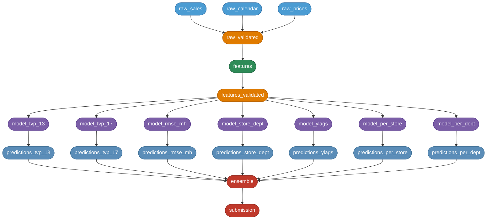

# ShelfSense M5 — Architecture

ShelfSense is a Dagster-orchestrated pipeline that transforms raw M5 competition CSVs into a Kaggle-ready submission through 22 data assets, 20 asset checks, 7 model variants, and full MLflow experiment tracking. This document describes the system structure, data flow, schema enforcement strategy, DVC versioning model, tool rationale, and known constraints.

---

## System diagram



**Colour key:**
| Colour | Stage |
|--------|-------|
| Blue | Raw data (DVC-tracked CSV loaders) |
| Orange | Validation (Pandera schema checks) |
| Green | Feature engineering (per-store parquet writer) |
| Purple | Model training (LightGBM variants) |
| Teal | Predictions (recursive or direct-horizon inference) |
| Red | Ensemble + Kaggle submission |

---

## Data flow

Each node in the graph corresponds to a Dagster `@asset`. The table below records what each asset reads, what it writes to disk (if anything), and what it returns to downstream assets.

| Asset | Reads from | Writes to disk | Returns | Checked by |
|-------|-----------|----------------|---------|------------|
| `raw_sales` | `data/raw/…/sales_train_evaluation.csv` | — | `pd.DataFrame` (30,490 × 1,947) | `check_sales_row_count` |
| `raw_calendar` | `data/raw/…/calendar.csv` | — | `pd.DataFrame` (1,969 rows) | — |
| `raw_prices` | `data/raw/…/sell_prices.csv` | — | `pd.DataFrame` (~6.8 M rows) | — |
| `raw_validated` | upstream DataFrames | — | `dict[str, DataFrame]` | — (Pandera runs inside asset body) |
| `features` | `raw_validated` dict | `data/processed/features/<store>.parquet` × 10 | `output_dir: str` | `check_features_parquet_count`, `check_features_no_nan_d_num` |
| `features_validated` | parquets on disk (re-reads) | — | same `output_dir: str` | — (Pandera runs inside asset body) |
| `model_tvp_13` | parquets via `output_dir` | `data/models/tvp_1p3/h_01.pkl … h_28.pkl` | `{"model_dir": str, "val_wrmsse": float}` | `check_model_tvp_13_pkl_count`, `check_model_tvp_13_val_wrmsse` |
| `model_tvp_17` | parquets | `data/models/tvp_1p7/h_*.pkl` | same schema | two pkl/wrmsse checks |
| `model_rmse_mh` | parquets | `data/models/rmse_mh/h_*.pkl` | same schema | two pkl/wrmsse checks |
| `model_store_dept` | parquets | `data/models/store_dept/lgbm_SD_*.pkl` (1–70 files) | same schema | `check_model_store_dept_pkl_count`, `check_model_store_dept_val_wrmsse` |
| `model_ylags` | parquets | `data/models/ylags/h_*.pkl` | same schema | two pkl/wrmsse checks |
| `model_per_store` | parquets | `data/models/per_store/<store>/h_*.pkl` | same schema | pkl count + wrmsse |
| `model_per_dept` | parquets | `data/models/per_dept/<dept>/h_*.pkl` | same schema | pkl count + wrmsse |
| `predictions_<variant>` | pkl files on disk + parquets | `data/predictions/<variant>/<store>.parquet` | `preds_dir: str` | Pandera `predictions_schema` check |
| `ensemble` | all `preds_dir` paths | `data/predictions/ensemble/ensemble.parquet` | `preds_dir: str` | Pandera `predictions_schema` check |
| `submission` | ensemble parquet | `submissions/<variant>.csv` | `submissions_dir: str` | Pandera `submission_schema` check |

**Ephemeral vs persistent:**
- **Ephemeral** (in-memory only): `raw_sales`, `raw_calendar`, `raw_prices`, `raw_validated`. These DataFrames live only for the duration of the Dagster run; they are not written to disk and are re-loaded on every materialization.
- **Persistent** (disk-backed): everything downstream of `features`. Once written, these assets are skipped on re-run if the file already exists (feature engineering) or overwritten (model/prediction assets). The DVC pointer files track the content-addressed state of the two largest directories.

---

## DVC data versioning

Two directories are tracked by DVC rather than git:

| Directory | Size | DVC pointer file |
|-----------|------|-----------------|
| `data/raw/m5-forecasting-accuracy/` | ~450 MB (4 CSVs) | `data/raw/m5-forecasting-accuracy.dvc` |
| `data/processed/features/` | ~905 MB (10 parquets) | `data/processed/features.dvc` |

**How pointer files work:** When you run `dvc add data/processed/features/`, DVC computes a content-addressed MD5 hash of the directory tree and writes it into `features.dvc`. The actual bytes are stored in `.dvc/cache/` locally and pushed to the remote (`gdrive://shelfsense-m5-dvc`) by `dvc push`. `git add features.dvc` commits only the hash (a few bytes), not the 905 MB directory.

**On a fresh clone:**
```
git clone …
dvc remote modify --local gdrive gdrive_use_service_account true
dvc remote modify --local gdrive gdrive_service_account_json_file_path secrets/gdrive-sa.json
dvc pull   # downloads blobs by hash, reconstructs the two directories exactly
```

**Updating tracked data** (e.g. after re-running feature engineering):
```
dvc add data/processed/features/
git add data/processed/features.dvc data/processed/.gitignore
git commit -m "data: update feature parquets"
dvc push
```

The hash in `features.dvc` changes only when file contents change. If the pipeline produces bit-identical output, `dvc push` uploads nothing. This is the reproducibility guarantee: the `.dvc` pointer in git uniquely identifies the exact bytes that produced any given result.

See [RUNBOOK.md](RUNBOOK.md) for the one-time GCP service account setup.

---

## Pandera schema enforcement

Pandera validates DataFrames at four boundaries. All validations use `lazy=True`, which collects all violations before raising — so a single run surfaces every schema error rather than stopping at the first.

```
  CSV files
      │
      ▼
raw_sales_schema ──────────────────── boundary 1: raw CSV load
raw_calendar_schema                    (coerce=True; nulls allowed in d_* cols)
raw_prices_schema (strict)
      │
      ▼
  raw_validated (dict)
      │
      ▼  feature_engineer()
  per-store parquets
      │
      ▼
feature_schema ─────────────────────── boundary 2: after feature engineering
(strict=True; hierarchy cols must be Category dtype;                          
 d_num must be ≥1 and non-null; lag/roll cols nullable float)
      │
      ▼
  model training  →  pkl files
      │
      ▼  recursive / direct-horizon inference
  prediction parquets
      │
      ▼
predictions_schema ─────────────────── boundary 3: model output
(id + d_1914..d_1941; all values ≥ 0; no nulls)
      │
      ▼  column rename d_1914→F1 … d_1941→F28
      ▼
submission_schema ──────────────────── boundary 4: Kaggle submission format
(id + F1..F28; all values ≥ 0; no nulls)
```

**What each schema enforces:**

| Schema | Key checks |
|--------|-----------|
| `raw_sales_schema` | `id`, `item_id`, `dept_id`, `cat_id`, `store_id`, `state_id` non-null; `d_*` columns float/nullable |
| `raw_calendar_schema` | `wday` in 1–7; `month` in 1–12; `snap_*` in {0,1} |
| `raw_prices_schema` | `sell_price > 0`; no extra columns (`strict=True`) |
| `feature_schema` | `dept_id`, `cat_id`, `store_id`, `state_id` as `pa.Category`; `d_num ≥ 1`; `weekday` 0–6; `month` 1–12; `sell_price ≥ 0`; `strict=True` |
| `predictions_schema` | exactly columns `id` + `d_1914`…`d_1941`; all forecast values `≥ 0` |
| `submission_schema` | exactly columns `id` + `F1`…`F28`; all forecast values `≥ 0` |

The `feature_schema` catching `NaN` in `d_num` was motivated by a real bug found during Stage 3 — a join ordering issue produced NaN day-indices that would have silently corrupted lag feature lookups.

---

## Asset checks

Each model and prediction asset has at least two `@asset_check` functions that run after the asset materializes. A failing check blocks all downstream materializations.

| Check type | What it verifies | Failure action |
|-----------|-----------------|---------------|
| pkl count (`_check_mh_pkl_count`) | `h_01.pkl … h_28.pkl` all present in model dir | Blocks predictions asset |
| store×dept pkl count | 1–70 `lgbm_SD_*.pkl` files present | Blocks predictions asset |
| WRMSSE range (`_check_val_wrmsse`) | `0.5 < val_wrmsse < 1.5` | Blocks predictions asset |
| parquet count | exactly 10 store parquets in features dir | Blocks all downstream |
| d_num NaN | no NaN in `d_num` column in any parquet | Blocks all downstream |
| row count | `raw_sales` has exactly 30,490 rows | Informational |
| Pandera (predictions) | `predictions_schema` on output parquet | Blocks ensemble |
| Pandera (submission) | `submission_schema` on output CSV | Final guard |

The WRMSSE range guard (0.5–1.5) is wide enough to pass every known model variant, but tight enough to catch a model that degrades to near-SN28 baseline (0.88+) or produces nonsensical negative-loss output. The check fires before ensemble blending so a broken model variant cannot silently corrupt the ensemble weights.

---

## Tool rationale

**Dagster** — chosen for its asset graph model rather than task/DAG model. The key benefit is *asset checks*: a native concept that runs validation code after materialization and blocks downstream assets on failure. This caught several real wiring bugs during Stage 4 development (wrong `preds_dir` paths, missing upstream config keys) before they propagated to ensemble weights. The Dagster UI gives lineage and re-materialization at the asset level for free. Alternative: Prefect/Airflow. Both lack native asset checks and require manual output validation; neither has the Dagster UI's asset-centric lineage view.

**MLflow** — every asset materialization opens an MLflow run and logs params, metrics, and a tag pointing to the artifact directory. This makes it possible to diff any two model variants (tvp=1.3 vs tvp=1.7, for example) in a single experiment view without reading code or filesystem state. The key design decision: `MLflowResource` is a Dagster `ConfigurableResource` so the tracking URI is injected per-run rather than hardcoded, enabling the same code to run against local MLflow (tests), Docker Compose MLflow, and a remote server without changes. Alternative: W&B. Similar capability but requires an account and network access; MLflow is self-hosted and free.

**Hydra** — one YAML file per model variant in `shelfsense/config/model/`. Running `shelfsense train tweedie-mh` loads `tweedie_mh_tvp13.yaml` without any code changes; running `shelfsense train tweedie-mh --tvp 1.7` overrides one field. This means adding a new model variant is a file addition, not a code edit. Alternative: argparse or env vars. Neither supports composable configs or per-field CLI overrides without explicit argument definitions for every hyperparameter.

**DVC** — the raw CSVs (450 MB) and feature parquets (905 MB) are too large for git. DVC content-addresses the data in the same repo so the git history is the canonical record of both code and data state: checking out any commit gives you the code *and* the exact data hash that produced any given result. Alternative: Git LFS. Git LFS stores large files as pointers but is billed per bandwidth on GitHub, doesn't support compute-addressed caching, and lacks the pipeline stage tracking that DVC provides. S3/GCS buckets work at scale but add cost; Google Drive (used here) is free at this data volume.

**Pandera** — schema enforcement at every persistence boundary means data quality bugs surface at the asset that produced bad data, not five steps downstream when a model fails mysteriously. `lazy=True` collects all violations before raising, so a single bad feature engineering run surfaces every schema error in one pass rather than requiring repeated re-runs. Alternative: `assert` statements or manual dtype checks. These are not composable, not reusable across assets, and produce single-failure-mode error messages that are harder to diagnose.

**Docker** — the multi-stage Dockerfile (CUDA base → builder → runtime) ensures the training environment is byte-identical across machines. The non-root user in the runtime stage follows container security best practice. The `docker-compose.yml` wires the train container, MLflow server (:5000), and Dagster webserver (:3000) on a shared network so the training container can reach both services by hostname. Alternative: conda envs or bare venvs. Neither provides OS-level reproducibility or network service wiring.

**GitHub Actions** — two workflows: `ci.yml` runs lint (`ruff`), type-check (`mypy`), and the 111-test suite (`pytest --cov=shelfsense`) on every push to any branch. `release.yml` builds the Docker image and pushes to `ghcr.io` on `v*.*.*` tag push. Having CI on every push means the main branch is always green; test failures are caught at the feature branch level, not at merge time. Alternative: pre-commit hooks only. Hooks run locally and can be bypassed; CI cannot.

**uv** — resolves and locks the entire dependency graph in ~2 seconds vs pip's 30–60 seconds for this environment. The `uv.lock` file pins every transitive dependency to an exact version and hash, so `uv sync --frozen` in CI and Docker produces a bit-identical venv every time. Extras (`dev`, `dl`, `submission`) are declared in `pyproject.toml` and resolved together to ensure no cross-extra conflicts. Alternative: pip + `requirements.txt`. `requirements.txt` does not natively express extras, and pip's resolver does not guarantee reproducibility without a hash-pinned constraints file.

---

## Known constraints

**Dagster pinned to `<1.9.3` (antlr4 conflict with hydra-core)**

`dagster>=1.9.3` ships `AssetSelectionLexer.py` generated by ANTLR 4.13.2, whose ATN serialization format is incompatible with `antlr4-python3-runtime==4.9.3` required by `hydra-core==1.3.2`. The two runtimes cannot coexist. Dagster 1.9.2 uses a regex-based `parse_clause()` that works with antlr4 4.9.x. **Resolution path:** drop Hydra (replace with plain dataclass configs) to remove the antlr4 pin, then upgrade to current Dagster. Note: in Dagster 1.9.2, `*asset_name` in the select DSL means "asset and all transitive upstreams" (equivalent to `+asset_name` in the ANTLR DSL of 1.9.3+). See [RUNBOOK.md](RUNBOOK.md) for the full diagnosis.

**WSL2 memory pressure on full pipeline materialization**

`dagster.materialize()` holds all step outputs in-process across step boundaries. Materializing all 22 assets sequentially keeps DataFrames alive during the raw → features → models transition, which can exceed 8 GB RAM under WSL2's default 50%-of-host cap. Symptom: kernel OOM-kills the process at the features → model transition. **Workaround:** run on a machine with >16 GB available to WSL2, or materialize in segments (`shelfsense features build`, then `shelfsense train …`). **Architectural fix:** adopt a Dagster IO manager that serializes each step output to a local path so intermediate DataFrames are freed between steps — the asset graph already supports this; only the IO manager config needs changing.

**GitHub Actions: Node.js 20 deprecation (June 2026)**

CI warns: "Node.js 20 actions are deprecated… forced to run with Node.js 24 starting June 2nd, 2026." Affected: `actions/checkout@v4`, `actions/setup-python@v5`, `actions/cache@v4`, `astral-sh/setup-uv@v3`. Plan: upgrade each action to its Node.js 24-compatible release before the deadline. No action needed today — workflows pass on Node.js 20. See [RUNBOOK.md](RUNBOOK.md) for the full action inventory.
